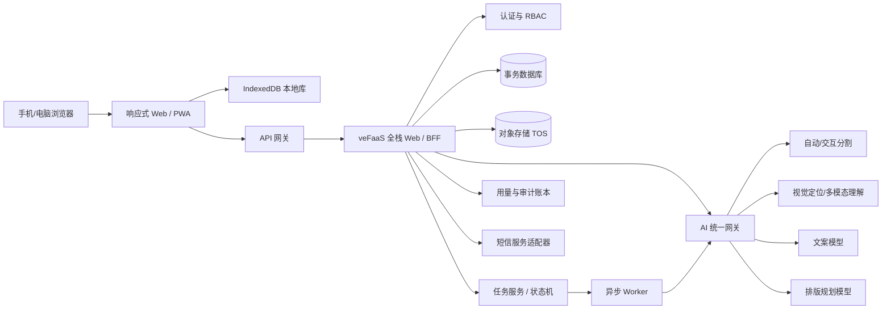

# 拾页 SHIYE：AI 与后端技术方案

> 文档版本：V1.3  
> 文档状态：首发 Web 架构基线，开发前评审版  
> 更新日期：2026-09-08  
> 适用对象：产品、前端、后端、AI、测试、运维  
> 关联文档：《拾页-PRD.md》《拾页-产品设计文档.md》《AI Agent 产品上线部署手册.md》

## 0. 结论

【已确认/页面事实】拾页首发为同时适配手机和电脑浏览器的响应式全栈 Web 产品，面向中国大陆用户，以个人主体进行早期验证；开发完成后通过火山引擎 veFaaS 部署，首期使用平台/API 网关提供的公网 HTTPS 地址，不以自有域名为当前前置条件。

【已确认/页面事实】产品包含游客模式、预注册邀请码、纯手机号短信验证码注册/登录、登录后选择导入游客作品与云同步、会员兑换码、管理员后台、一句话选主体、AI 文案和会员 AI 自动排版；首版不接密码登录和在线支付。

【已确认/页面事实】2026-09-07 由 Song 确认并同步四项开发基线：已有手帐先翻阅、主动进入编辑；自动分类、自定义贴纸包、绘画画笔及用户作品导出不增加到首发；注册后一句话选主体同图继承已用、新图按账号每图额度，AI 文案仍按月衔接；退出保留账号本地作品并隔离访问，再次登录同一账号后才可查看。下文描述目标契约，不表示现有原型已具备账号或额度实现。

【建议设计】火山引擎是部署目标，不是必须写死到业务代码里的实现细节。业务层只依赖稳定的 Auth、Database、ObjectStorage、AIProvider、UsageLedger 接口；veFaaS、API 网关、TOS、具体数据库和模型供应商通过适配层与部署配置接入。

### 0.1 2026-09-08 交互升级的技术契约

【已确认/页面事实】自动提取照片中所有主要物体为主流程；手绘大致轮廓用于漏提/错提纠正，再由真实分割自动贴边。原型目前无服务端或真实 SegmentationProvider；本地轮廓裁切不是自动分割。以下为待实现契约，不表示已有接口可调用。

### 分割提示与结果

- 自动任务返回独立 candidateId、mask、bbox 与可选质量信息；分页/分批返回主要物体，不用固定 6 个候选静默截断。记录供应商硬限制，在代表性标注集评估逐物体召回。
- refine 输入包含 imageSessionId、sourceRevision、promptRevision、可选 targetCandidateId，以及 outlinePoints（归一化原图坐标，闭合轮廓）。客户端要校正缩放、留白和图像方向；服务端验证点数、范围、归属与请求大小。
- 轮廓表达目标的大致范围，不把轮廓内所有像素直接认作主体。适配器须调用支持轮廓/蒙版提示或经实测等价提示的交互分割；不支持时明确报能力不可用。粗略轮廓转单一 bbox 不能单独证明能完成贴边。
- 响应保留上述三个版本标识；换图、重画、取消后丢弃旧结果。新蒙版预览确认后才生成资产；保留未被本次纠正影响的成功候选。
- 未连接服务时不伪造识别和成功结果；本地裁切是单独标记的试用。密钥只在服务端；照片上传沿用原授权和对象归属规则。纯几何提示不计入“一句话”权益，不新增收费规则；交互分割的实际供应商成本仍记录。
- 验收须包含漏提新增、错提纠正、相邻重叠物体、轮廓粗糙、换图旧响应、服务不支持、超时与重试。模型未确定前自动贴边为阻断项。

### 创作数据与书页

- 贴纸资产先事务保存，成功后才进入选书或来源书页。来源使用 bookId/pageId，而非易变的页序号；保存失败留在当前状态允许重试，同一资产 ID 不重复写入。
- 元素继续保存结构化位置、宽度、旋转；文字增加 direction=horizontal|vertical 和可选高度 h，旧数据缺省按横排解释。一次手势一条撤销记录，指针移动只更改内存，结束后写盘。
- 双指距离比例映射等比尺寸，夹角差映射旋转；限制极小距离和尺寸上下界，防止 NaN 或翻转。桌面和移动保留控制柄/按钮替代。
- 页面仍按 pages[] 独立存储；桌面展开由内封＋page[0]，page[1]＋page[2]……派生。同张纸两面引用不同 pageId；翻页层只读渲染，不复制或覆盖页面数据。编辑仅选中单页；不允许跨书脊元素。
- 沿用现有版本冲突保护与先保存后翻阅；动画取消、窗口改变和模式切换必须清理折页层，不重置用户内容。

## 1. 架构是否固定

不固定。应分为两层：

### 1.1 已固定的产品与安全边界

- 浏览器不能持有模型、短信、对象存储或云平台密钥。
- 管理员与普通用户权限必须由服务端校验。
- 游客本地先保存；登录后异步云同步。
- 账号本地作品退出后保留但不可访问；游客与其他账号不得读取或同步这些数据。
- 完整原图不作为长期云端作品保存。
- 图片、缩略图等二进制进入对象存储，数据库只保存元数据和对象键。
- 浏览器通过短期凭证将照片直传私有对象存储；异步任务消息只携带 objectKey 等元数据，不携带图片正文。
- 邀请码、兑换码、额度扣减和兑换必须原子化、幂等、可审计。
- AI 结果先校验和预览，不自动覆盖手工内容。
- 所有模型调用经过统一网关，记录质量、耗时、用量与成本。

### 1.2 部署时仍可调整的实现

- 前后端部署为一个 veFaaS Web 应用，还是后续拆成两个应用。
- 具体 Web 框架和后端语言。
- 个人主体最终可用的生产数据库。
- TOS 的桶、地域、生命周期和访问方式。
- 模型主备供应商、模型快照版本和超时。
- 是否设置预留实例、实例规格、并发和预算告警。
- 是否绑定自定义域名、CDN、Sentry 或其他监控服务。

这些实现只能在保持 1.1 的业务合同、数据安全和验收标准不变时替换。

## 2. 与部署手册的关系和冲突处理

【已确认/页面事实】部署参考文件位于：`/Users/song/Documents/Vibe Coding 技术栈/AI Agent 产品上线部署手册.md`。它是上线操作指南，不是拾页的产品需求，也不自动覆盖本方案。

冲突优先级：Song 对拾页的最新确认 → 拾页 PRD → 本技术方案 → 产品设计文档 → 通用部署手册 → 部署时重新核验的火山引擎官方文档。

| 手册内容 | 拾页处理 | 原因 |
|---|---|---|
| veFaaS + API 网关公网 HTTPS 地址 | 采用 | 符合无自有域名的早期上线方式 |
| TOS 存放图片等大文件 | 采用接口边界，部署时核对参数 | 贴纸和缩略图不应进入关系数据库 |
| 密钥使用 Secret/环境变量，不入仓库/前端 | 强制采用 | 安全底线 |
| 邀请码直接换登录 token | 不采用为最终账号模型 | 拾页的邀请码只负责首次访问；注册/登录使用手机号验证码 |
| `INVITE_CODES` 环境变量保存邀请码 | 不采用 | 拾页需要后台批量创建、状态管理、单账号绑定、游客额度和审计，应存哈希化业务记录 |
| AI 生成邀请码并明文交付 | 不采用 | 由管理员后台创建；完整码只在创建/导出时展示 |
| SQLite 位于 veFaaS `/tmp`，靠常驻实例和 TOS 备份 | 仅作封闭测试备选，不作为默认可靠生产库 | `/tmp` 是临时存储；账号、兑换、额度和同步需要事务、一致性与明确恢复点 |
| 正式前端、后端必须是两个应用 | 不写死 | 首发可用一个全栈 Web 应用降低成本；达到拆分条件再拆 |
| 子账号统一授予多项 FullAccess | 不直接照搬 | 部署时按真实资源实施最小权限；扩大权限需 Song 知情 |
| “网址能打开”即可判定上线成功 | 只作为连通性检查 | 还必须验证健康检查、登录、权限、数据持久化、对象存储和 AI 主流程 |
| 将 AK/SK 发送给 AI 会话 | 不采用 | 密钥应由 Song 在本机/平台受控登录或 Secret 中配置，不在对话中明文发送 |

【未知/尚未确认】部署手册中关于个人主体可用云数据库、运行时、命令参数、网关和 TOS S3 兼容细节可能随平台更新。真正部署时必须用当时的 veFaaS Skill 与官方文档重新核验，不能把本文示意当作永久命令。

## 3. 推荐的首发系统结构



### 3.1 首发代码形态

【建议设计】优先使用一个 TypeScript 全栈代码库：用户端、管理员端、同源 API/BFF 共用一套代码与契约；同步 Web 入口和异步 Worker 可以是同仓库的不同部署目标。这样可复用类型和校验规则、减少 CORS 与维护成本，同时避免把图像与 AI 长任务阻塞在普通页面请求中。

【建议设计】达到以下任一条件再拆分前后端/worker：图片上传受 Web 应用体积或超时限制；AI 任务需要独立扩缩容；管理员和用户端发布节奏明显不同；监控显示单体成为性能或安全边界问题。

### 3.2 当前原型迁移

当前 `index.html`、`styles.css`、`app.js` 是视觉和交互参考，不具备正式账号、API、数据库、云同步或真实抠图能力。迁移时保留视觉令牌、文案和已验证的交互意图，不以复制原型状态代码代替正式数据模型。

【已确认/页面事实】正式工程保留原 PRD 已确认的核心范围，不因原型控件而新增自动分类、贴纸包、绘画画笔或用户作品导出服务；既有管理员邀请码/审计导出和账号数据权利处理不在排除范围内。

【建议设计】书页交互状态区分 reading 与 editing：已有手帐加载成功后进入 reading，仅主动“编辑”进入 editing；新建空白手帐可直接 editing。模式为视图状态，不应增加页面 revision 或重建元素；reading 不触发内容变换或 AI 应用。正常、跳过和减少动态效果都使用同一模式转换规则；编辑切回翻阅前提交本地改动，失败时保持可恢复状态。

## 4. 身份、邀请码与权限

### 4.1 用户状态

```text
未获邀访问者
  ├─ 已有账号 → 手机号验证码登录
  └─ 验证未绑定邀请码 → guest + inviteAccessGrant
       ├─ 本地制作
       └─ 手机号验证码注册 → user
            └─ 兑换会员码 → member entitlement

受控初始化 → admin
```

- 一个邀请码对应一个未来账号；绑定前可在任意手机、电脑和浏览器验证。每次验证签发浏览器级 inviteAccessGrant，Grant 只引用 inviteCodeId，不包含明文邀请码。
- 验证不会创建账号，也不会让不同浏览器的 IndexedDB 自动互通。各浏览器的游客作品独立，但联网体验额度统一按 inviteCodeId 汇总。
- 注册事务验证手机号、锁定邀请码记录、确认仍为未绑定状态、创建账号并写入 boundUserId/boundAt，随后将邀请码置为已绑定并撤销全部关联 Grant；同一码不能绑定第二个账号。
- 已有账号登录入口不经过邀请码验证。首版后续登录只使用手机号短信验证码，不设置密码。
- 管理员不能通过普通注册、邀请码或兑换码产生；初始管理员由部署期受控初始化。
- 停用账号阻止登录、同步和 AI 调用，但不自动删除作品。
- 用户主动退出时服务端撤销当前会话；账号本地作品按第 5.1 节保留并锁定访问，不清空或改归属游客。账号注销/删除请求需要短信再次验证、状态流转和后台数据清理；具体冷静期与法定日志保留边界在上线前确定。

### 4.2 服务端授权

- 每个用户资产含 ownerId；查询和写入在服务端强制追加 ownerId 条件。
- `/api/admin/*` 只允许 admin；前端隐藏菜单不能作为权限控制。
- 管理员默认也没有“浏览用户作品正文/原图”的业务接口。
- 会话建议使用 HttpOnly、Secure、SameSite Cookie；状态修改接口实施 CSRF 防护或同源 token。
- inviteAccessGrant 与登录会话使用不同 audience/scope；邀请码一旦绑定，服务端每次使用 Grant 时均因 code 状态为 bound 而拒绝，不能只依赖客户端删除 Cookie。
- 登录、邀请码、短信发送、兑换和管理员操作分别限流。

### 4.3 短信服务

【已确认/页面事实】开发环境允许测试手机号/验证码；生产环境只能启用真实短信供应商，测试验证码必须通过环境隔离彻底关闭。

【未知/尚未确认】个人主体的短信签名、资质和模板能否通过实际审核。代码使用 SmsProvider 接口，审核前不把某一短信供应商写成不可替换依赖。

## 5. 数据与存储

### 5.1 本地数据

IndexedDB 至少包含：books、pages、elements、stickerAssets、blobs、settings、syncQueue、conflicts、schemaMeta。localStorage 只保存极小的非敏感引导/显示设置，不存图片、token 或整本书。

【已确认/页面事实】退出保留账号已保存的本地作品；再次登录同一账号前不可访问。游客、账号 A、账号 B 的本地作品不能混放在无归属的共享 workspace 中，也不能仅靠隐藏卡片实现隔离。

【建议设计】账号本地存储与退出流程的实现约束：

- 本地数据访问层对书、页、元素、素材、Blob、缩略图、最近打开、缓存和同步队列统一校验 scope/ownerId；可采用分库或严格分区，但不能漏掉素材引用及离线缓存。游客导入仍由用户勾选，成功前保留副本，不自动认领未选内容。
- 退出前处理尚未保存的内存改动：优先本地提交；失败则提示重试或由用户明确确认放弃未保存部分。已成功保存的数据不能因退出被删除。
- 开始退出时关闭账号作品视图、停止旧账号的 AI/同步任务调度并撤销会话；清除内存中的作品、预览 URL 和可用解锁材料，保留已保存的账号数据及带原 ownerId 的待同步任务。检查完成前的旧异步响应归属，不回填到游客或新账号界面。
- 离线或会话撤销失败时先锁定本地账号访问，不宣称服务端会话已成功撤销；联网后重试。退出之后不得仅凭 localStorage 的上次 userId 解锁；须再次验证同一账号。已登录期间的断网编辑与“退出后重新解锁”分开处理。
- 重新登录 A 后只解锁/恢复 A 的数据和队列；登录 B 不读取、展示或提交 A 的待同步内容。覆盖浏览器后退、刷新、多个标签页、搜索和资源 ID 访问路径。
- 命名空间隔离不等于磁盘加密；本地缓存保护、加密和密钥解锁的具体方案在账号存储模块定型前验证。不把明文 IndexedDB 加界面隐藏描述为已经实现安全隔离，也不承诺抵御具有设备管理员权限的读取。

### 5.2 云端业务数据

关系数据至少包含：users、invite_codes、invite_access_grants、membership_codes、membership_redemptions、entitlements、usage_ledger、provider_configs、jobs、job_attempts、upload_sessions、books、pages、elements、sticker_assets、sync_operations、import_batches、audit_logs。

关键要求：

- 邀请码和兑换码只保存哈希；邀请码状态至少包含 unbound、bound、disabled、expired，并以 boundUserId 唯一约束保证只绑定一个账号。
- 兑换码消费、会员生效、额度预留/确认/释放使用数据库事务。
- operationId 建唯一约束，避免重试重复扣费或重复兑换。
- 一句话用量账本保留稳定的图片计次关联及 inviteCodeId/userId 映射；临时处理会话重建、注册或刷新不能把同图当作零用量新图。具体图片标识方案见第 7.2 节。
- Page 至少包含 schemaVersion、revision、paperId、journalMeta（date、locationLabel、locationPrecision、mood）；文字元素包含 locked 和 AI 来源元数据。作品数据使用 ownerId、schemaVersion、revision、deletedAt。
- 游客作品导入按 importBatchId 幂等；为导入对象生成新云端 ID 并保存 localId→cloudId 映射，整批确认前不删除本地副本。
- 管理员调整权益必须同时写业务变更和审计日志。

### 5.3 数据库部署决策闸门

【建议设计】目标是支持事务和并发控制的持久化关系数据库。个人主体在火山引擎上最终可用的产品与资质需在部署前核验。

若早期只能使用部署手册的 SQLite 轻量方案，必须同时满足：封闭邀请测试、明确单实例约束、数据库写入串行化、频繁 TOS 备份、启动恢复演练、向 Song 明确最大可接受数据丢失窗口，并禁止对外宣称高可靠。正式开放会员或扩大用户前迁移到持久化数据库。

### 5.4 对象存储

长期保存：透明贴纸、贴纸缩略图、必要封面/官方素材。临时保存：待分割压缩图、蒙版中间结果、文案使用的低清缩略图批次。

对象键随机化并按 userId/inviteCodeId/uploadSessionId 分区；桶保持私有。浏览器先调用上传初始化接口，获得仅允许写入指定 objectKey、限制大小/MIME 且短期有效的凭证，再把压缩图直接上传 TOS。任务提交只传 objectKey；服务端必须复核对象归属、文件头、像素和大小，不能信任客户端元数据。

临时对象配置生命周期删除并记录 expiresAt；异步任务 Payload 不含图片正文。完整原图的具体最长保留时间是上线前隐私决策项，不能无限期保留。

### 5.5 云同步

- 本地事务成功后写入 syncQueue。
- 登录且联网时按 operationId 推送差量。
- 云端按 baseRevision 做乐观并发控制。
- revision 分叉时生成冲突副本，不使用最后写入静默覆盖。
- UI 分别显示“已保存到本机、正在同步、已同步、同步失败”。
- 完整原图不进入同步；跨设备恢复的是结构化手帐与已保存透明贴纸。
- 注册/登录后不自动认领游客作品；用户勾选后创建 importBatch，云端成功才更新本地归属状态。其他浏览器的游客作品需在对应浏览器登录后分别导入。

### 5.6 上传与异步任务

1. `upload/init` 校验主体、用途、声明的 MIME/大小和额度，创建 uploadSession，并返回指定 objectKey 的短期上传凭证。
2. 浏览器直传后提交 objectKey + operationId 创建 job；API 快速返回 `202 Accepted` 和 jobId。
3. job 状态只允许 queued → running → succeeded/failed/cancelled/expired；每次供应商调用记为独立 attempt，但共享顶层 operationId 和额度预留。
4. 前端通过 `GET /api/jobs/{jobId}` 轮询；后续可增加 SSE，但状态真值始终在数据库，不能只存在连接内存。
5. 取消先标记 cancellation_requested；能力支持时向 Worker/供应商传播取消信号。迟到结果可以结算真实供应商成本，但不得覆盖新 imageSession 或自动写入页面。
6. job 结果只保存可显示所需的对象键和结构化数据，并按 expiresAt 清理。自动重试只处理明确的瞬时系统错误，使用同一 operationId 且有次数上限。

## 6. AI 能力拆分

| 产品功能 | 必需 AI/算法能力 | 是否需要大语言/视觉模型 | 输出 |
|---|---|---|---|
| 自动候选抠图 | 多主体实例分割/抠图 | 否，可使用专用 CV 服务 | 独立 mask、bbox、透明图 |
| 点一下/框一下 | 交互式分割 | 否，可使用 SAM 类或供应商交互分割 | 精确 mask |
| 一句话选主体 | 中文视觉指代定位 + 交互分割 | 是，需要多模态 VLM 做 grounding；随后仍需分割模型 | point/bbox → mask |
| AI 文案 | 当前页视觉理解 + 中文短文生成/润色 | 是；可由多模态模型理解缩略图，文本模型完成低成本生成 | 40–100 字预览 |
| AI 自动排版 | 页面语义理解、空间规划、结构化输出 | 是，优先多模态模型或视觉模型 + 规则引擎 | 可编辑 layout JSON |

结论：拾页需要大模型，但大模型不负责所有抠图。自动分割和点/框分割优先使用专用视觉模型；只有一句话定位、文案和排版需要 VLM/LLM。

## 7. AI 调用链与成本控制

### 7.1 分层调用

```text
上传图片
  → 自动分割（每图基础调用）
  → 用户选择已有候选：不调用 VLM
  → 漏选时：
       点/框 → 交互分割
       一句话 → VLM 定位 → 交互分割
```

单图期望成本可表达为：

`C_photo = C_auto_seg + fallback_rate × (C_grounding + C_refine_seg)`

该设计减少 VLM 调用次数，但实际抠图成本仍取决于供应商按图片、调用还是主体计费，以及一次返回独立多 mask 还是合并前景。

### 7.2 已确认额度

| 能力 | 未注册游客（按邀请码累计共享） | 免费注册用户 | 会员 | 计次规则 |
|---|---:|---:|---:|---|
| 自动主体识别 | 5 张照片 | 配置化基础能力 | 配置化基础能力 | 游客成功产生有效候选后消耗 1 张 |
| 点选/框选 | 10 次 | 不消耗一句话额度，受防滥用限流 | 不消耗一句话额度，受防滥用限流 | 游客成功产生可确认蒙版后计 1 次 |
| 一句话选主体 | 累计 3 次 | 每张图 3 次 | 每张图总计 10 次 | grounding + refine 为一个顶层操作；有效蒙版计 1 次；注册同图继承、新图独立，不按月重置 |
| AI 文案 | 累计 3 次 | 每月 10 次 | 每月总计 100 次 | 有效预览计 1 次；放弃仍计；重新生成另计 |
| AI 排版 | 不开放 | 不开放 | 每月 30 次 | 一批至少 1 个合格候选计 1 次；放弃仍计；切换同批不计 |

【已确认/页面事实】仅 AI 文案和 AI 排版的月度额度使用 Asia/Shanghai 自然月，每月 1 日 00:00 重置且不结转。当月升级会员后，AI 文案上限为当月总计 100 次，升级前免费用量包含在内；游客 AI 文案用量在注册时计入该账号注册当月额度。一句话选主体不使用月度周期：注册后同图继承游客阶段在该图上的已用次数，新图使用当前账号对应的每图额度，其他图片用量不扣到新图上。会员每图 10 次为总上限，已用次数包含在内。

【建议设计】历史 UsageLedger 保持不可变，邀请码绑定后通过 inviteCodeId→userId 关联结算：文案关联注册月，一句话关联具体图片；同一 operationId 只计一次，既不复制扣次，也不抹去游客用量。游客阶段仍先受邀请码累计 3 次限制，同时记录实际消耗发生在哪张图片，以支持注册后继承。

【建议设计】为图片设置独立于短期 imageSessionId 的稳定计次关联（暂称 quotaImageId），绑定原始上传归属及注册后的账号映射。每图剩余 = max(0, 当前每图上限 − 同图成功次数 − 同图预留次数)。元数据用于计次，不因此长期保存完整原图。示例：游客在 A 图成功用 2 次后注册免费账号，A 图剩 1 次；新 B 图可用 3 次；跨月不恢复 A 的已用次数。

【未知/尚未确认】稳定图片标识、重复上传/重编码图片识别及临时图片过期后如何保留计次关联，由技术验证确定。不能把刷新、重建处理会话或游客转账号作为重置同图额度的实现捷径；此项属于既定业务规则的工程验证，不自动新增每月额度。

### 7.3 扣额事务

1. 校验账号或 inviteAccessGrant、邀请码状态、能力和额度范围：游客累计、注册账号每图，或文案/排版自然月；每图操作同时校验图片计次归属。
2. 使用 operationId 幂等创建 pending ledger，并原子预留额度。
3. 调用模型并执行结果校验。
4. 有效结果：文案为通过校验的非空预览；排版为至少一个可渲染合格候选；一句话选主体为 grounding 后成功得到可确认蒙版。ledger=success，确认扣额并记录供应商用量/成本；用户随后放弃不退款。
5. 失败/超时/无效：ledger=failed，释放用户额度；供应商已产生的真实成本仍进入成本报表。

用户额度与供应商账单是两套数据：失败可以不扣用户次数，但不能把实际供应商成本记成零。

### 7.4 会员兑换结算

- 非会员或会员已过期：newExpiresAt = redeemedAt + codeDuration。
- 会员未到期：newExpiresAt = currentExpiresAt + codeDuration。
- 多个有效码可以连续兑换并顺延；每个 redemptionId 唯一且事务内更新权益。
- 停用兑换码只阻止新兑换，不撤回已生效期限；人工撤回必须是独立管理员动作并写审计。

## 8. 模型类型与选型策略

### 8.1 供应商适配

每项能力通过统一适配器接入：

- SegmentationProvider：全图主要物体候选、交互点/框/轮廓提示、真实边缘 mask 和透明图；供应商不支持轮廓时必须验证可用提示转换或更换能力，不能用 bbox 裁切冒充。
- VisionGroundingProvider：图片 + 中文短句 → point/bbox JSON。
- CopyProvider：当前页输入 → 文案 JSON。
- LayoutProvider：页面输入 → 1–3 个 layout JSON。

ProviderConfig 维护能力、供应商、模型快照、优先级、超时、最大输出、价格版本和 secretRef。管理员可启停和切换已实现的供应商，不允许用任意 URL 绕过服务端 allowlist。

### 8.2 首轮评测候选

【建议设计】不要因部署在火山引擎就自动把豆包定为唯一模型，也不要因某家 token 单价低就直接上线。首轮候选可包括：

- 视觉定位/排版：Qwen 多模态、豆包 Seed 多模态、MiMo 多模态、GLM-V、DeepSeek 视觉实验模型。
- 文案：上述供应商的低成本文本/多模态型号。
- 像素级抠图：百度智能抠图、其他能返回独立多主体 mask 且支持点/框的国内服务，或经部署验证的专用分割模型。

最终选择以内部评测为准，并固定可追踪的模型快照版本，不直接使用不可控的 `latest`。

### 8.3 评测指标

视觉定位：目标命中率、左右/前后/衣着等中文指代、bbox 稳定性、漏选率、JSON 合法率。  
分割：独立多主体、边缘完整性、发丝/毛发、遮挡、重复 mask、透明图质量。  
文案：事实幻觉、语气符合、长度、用户直接采用率/轻改采用率、每个有效结果成本。  
排版：越界、遮挡、碰撞、锁定元素保持、JSON 合法率、用户应用率、应用后撤销率。  
通用：P50/P95 延迟、错误率、限流、供应商实际人民币成本、失败成本。

## 9. 稳定业务 API

| API | 作用 | 核心保护 |
|---|---|---|
| `POST /api/access/invite/verify` | 未绑定邀请码换 inviteAccessGrant | 哈希比对、unbound 状态、有效期、限流；不创建账号 |
| `POST /api/auth/sms/send` | 发送登录验证码 | 图形/行为风控、冷却、日限额 |
| `POST /api/auth/register` | 原子绑定邀请码并创建账号 | 手机验证、邀请码行锁/条件更新、唯一 boundUserId |
| `POST /api/auth/login` | 手机验证码登录 | 不要求邀请码；错误次数、会话轮换 |
| `POST /api/auth/logout` | 撤销当前会话 | CSRF、会话版本/撤销列表 |
| `POST /api/account/deletion-requests` | 申请注销/删除云端账号数据 | 短信再验证、状态机、审计与保留规则 |
| `POST /api/membership/redeem` | 兑换会员 | 原子消费、幂等、审计 |
| `POST /api/imports` | 导入用户勾选的本机游客作品 | 新云端 ID、importBatchId 幂等、成功前不删本地 |
| `POST /api/uploads/photo/init` | 初始化照片直传 | 指定 objectKey、短期凭证、大小/MIME/主体限制 |
| `POST /api/segmentation/jobs` | 创建自动主体候选任务 | objectKey 归属、幂等、额度预留，返回 202 + jobId |
| `GET /api/jobs/{jobId}` | 查询任务状态/结果 | 所有权、过期、无内容日志 |
| `POST /api/jobs/{jobId}/cancel` | 请求取消任务 | 所有权、幂等、迟到结果隔离 |
| `POST /api/ai/ground` | 一句话定位 | 权益、VLM JSON 校验 |
| `POST /api/segmentation/refine` | 点/框精确分割 | imageSession、revision、坐标校验 |
| `POST /api/ai/copy` | 生成/润色当前页文案 | 最小输入、额度事务、预览 |
| `POST /api/ai/layout` | 新页编排或当前页重排 | 会员、mode、素材白名单、revision、Schema、安全区 |
| `POST /api/sync/push` | 提交本地差量 | ownerId、baseRevision、operationId |
| `GET /api/sync/pull` | 拉取云端变更 | ownerId、游标、软删除 |
| `/api/admin/*` | 管理后台 | admin RBAC、二次验证建议、审计 |

错误统一返回 requestId、errorType、retryable 和可选 retryAfter；生产环境不返回堆栈、供应商密钥或原始响应正文。

## 10. AI 结构化合同

### 10.1 视觉定位

```json
{
  "imageSessionId": "img_xxx",
  "sourceRevision": 3,
  "candidates": [
    {"type": "box", "x": 0.56, "y": 0.12, "width": 0.23, "height": 0.68, "score": 0.91}
  ]
}
```

坐标统一归一化到 0–1。score 只有供应商真实提供且含义可映射时才保留，不伪造。

### 10.2 文案

```json
{
  "operationId": "op_xxx",
  "mode": "generate",
  "tone": "natural",
  "text": "傍晚的风刚刚好，我们把这一天慢慢收进了书里。",
  "aiAssisted": true
}
```

服务端做长度、纯文本、空值和内容安全校验；前端只展示预览，不直接落页。应用后文字元素保存 operationId、aiAssisted=true 和后续 userEditedAfterGeneration 状态，用于来源追踪和适用的生成内容标识。

### 10.3 排版

```json
{
  "mode": "new_page",
  "sourceRevision": 18,
  "allowPaperChange": true,
  "style": "magazine",
  "candidates": [
    {
      "paperId": "paper_dot_01",
      "elements": [
        {"elementId": "el_1", "x": 0.12, "y": 0.16, "scale": 0.82, "rotation": -4, "zIndex": 1}
      ]
    }
  ]
}
```

`mode=new_page` 时，请求必须由用户显式选择 stickerAssetId 和已有 textDraft/textElement，候选生成期间不创建 Page，应用后才创建；模型不得访问未选择的仓库素材，也不得生成、改写或删除文字。`mode=relayout_current` 时只能返回当前页已有 elementId，locked 文字与贴纸保持原位，不得新增或删除元素。

服务端/前端必须验证：引用 ID 全部来自请求白名单；坐标、缩放、旋转和 zIndex 在允许范围；candidate 数量不超过 3；sourceRevision 与当前输入一致；paperId 只有 allowPaperChange=true 时可变化。每个候选分配 candidateId；应用接口再次提交 operationId、candidateId 和 expectedRevision，以单个页面事务创建或更新并生成撤销快照。

## 11. 管理后台

### 11.1 邀请码

创建批次、有效期、备注、启停、跨浏览器验证记录、共享游客额度和最终绑定账号。每个邀请码只能绑定一个手机号账号，状态为 unbound/bound/disabled/expired；完整码只在创建结果显示，列表仅掩码。

### 11.2 会员兑换码

配置 planId、有效天数、最大兑换人数、有效期和状态；查看兑换账号、时间和顺延后的到期日。停用只阻止后续兑换，不静默撤回已生效会员。

### 11.3 AI 接口

按能力查看主备模型、供应商、模型快照、优先级、状态、超时、价格版本和最近健康检查。Key 只能新增/轮换，不能再次明文读取。新配置先保存为 draft，健康检查通过后才能原子激活；保留 last-known-good 版本以便回退，避免一次表单提交直接切断全部 AI 能力。

### 11.4 账号与用量

查看账号状态、邀请来源、会员期限、额度、调用成功/失败、token/调用量、延迟、成本、云端对象数量和存储字节；支持启停账号和调整权益。所有写操作记录审计，管理员默认看不到作品正文和贴纸像素。

## 12. 隐私、安全与日志

- 调用图片 AI 前获得明确同意；联网恢复后不自动上传旧照片。
- 文案只发送当前页低清贴纸缩略图、日期、粗地点、心情和可选草稿。
- 排版只发送当前页结构和必要缩略图，不发送整本手帐。
- 日志不记录图片/base64、完整手机号、短信验证码、邀请码、兑换码、Cookie、token、手帐正文、书名或 API Key。
- 手机号加密或字段级保护；展示和日志只保留掩码。
- 管理接口、兑换、额度、同步实施越权与并发测试。
- 上传校验 MIME、文件头、像素和大小；下载使用内容类型白名单。
- 第三方模型的数据保留、训练使用、处理地区和删除能力在上线前逐家核验。
- 普通用户会话支持主动退出和服务端撤销，退出保留的账号本地数据执行第 5.1 节访问隔离；账号数据请求、注销、删除与法定保留通过明确状态机处理。
- AI 文案在界面和元素元数据中保留 AI 辅助来源。面向境内公众开放前，专项核验生成合成内容标识、服务协议、投诉举报、算法备案和安全评估的实际适用范围；本文不替代法律意见。
- 免费用户和会员的对象存储配额必须配置化；管理员用量视图同时监控 AI 成本和 TOS 存储量，超限不静默删除作品。

## 13. 火山引擎部署边界

【已确认/页面事实】上线使用 veFaaS 应用工作流，不在本阶段创建或修改任何云资源。部署时按当时版本完成：项目检测、网关确认、Secret/环境变量、应用发布、访问地址、日志与真实链路验收。

【建议设计】首发优先单一全栈 Web 应用 + API 网关公网地址 + TOS；数据库选择单列为部署阻断项。只有在验证数据库持久化、对象存储、管理员初始化、登录隔离、短信生产配置和 AI 密钥后，才称为可上线。

【已确认/官方事实】截至 2026-09-03 检索到的 veFaaS 官方“使用限制”页面规定同步调用 Payload 最大 16 MiB、异步任务 Payload 最大 128 KiB，异步任务执行时长为 10 秒至 3 小时；因此图片必须以 TOS objectKey 进入任务，不能塞入异步消息。官方页面未来如有变化，以部署时重新检索结果为准。

最低环境配置类别（只记录键名，不在文档填真实值）：

- `APP_ENV`、`APP_BASE_URL`、`SESSION_SECRET`
- `DATABASE_URL`
- `OBJECT_STORAGE_*`
- `JOB_MAX_ATTEMPTS`、`JOB_RESULT_TTL`
- `SMS_PROVIDER` 与对应 Secret 引用
- `AI_PROVIDER_*` 与对应 Secret 引用
- `TEMP_ASSET_TTL`
- `ADMIN_BOOTSTRAP_*`（首次初始化后关闭或轮换）

部署完成不能只验首页。至少验证：健康检查、邀请码跨浏览器与绑定失效、纯短信注册登录、游客作品选择导入、A/B 用户隔离、管理员 403/200、兑换顺延原子性、本地保存与云同步、TOS 直传、异步任务查询/取消/过期、四类 AI 调用、有效结果扣次与失败释放、临时图片删除和日志无敏感内容。

本轮确认新增的必验边界：已有手帐重开先翻阅且主动进入编辑；游客在同图用 2 次后注册免费账号，该图仅余 1 次、新图有 3 次，跨月不恢复同图次数；A 退出后游客/B 无法访问 A 的本地书、Blob、缩略图和队列，重新登录 A 可恢复已保存数据。以上均需真实实现后验收，不能由原型或文档检查替代。

## 14. 开发里程碑

1. 技术验证：浏览器画布、IndexedDB、自动/交互分割、VLM 定位、模型 JSON、数据库可用性。
2. 全栈底座：工程化 Web、认证/RBAC、数据库、对象存储、同步、审计、配置。
3. 贴纸与手帐：完整主旅程、本地保存、跨设备恢复、异常状态。
4. AI 与会员：admin、邀请码/兑换码、用量账本、文案、排版、选主体和主备降级。
5. 发布评审：性能、安全、隐私、模型质量/成本、短信资质、数据库恢复、veFaaS 部署与公网验收。

这些是同一个首发版本的内部交付顺序，不改变“一次开发覆盖已确认功能”的产品范围。

## 15. 当前未决项

1. 完整原图和临时 AI 文件的最长保留时间。
2. 个人主体最终采用的生产数据库，以及不可用时是否接受封闭测试 SQLite 备选的恢复点风险。
3. 手机短信签名和验证码模板的实际审核结果。
4. 首发分割、视觉定位、文案和排版模型的评测结果与主备路由。
5. 管理员二次验证方式。
6. 正式浏览器版本、图片大小/像素、页面/元素/贴纸上限。
7. 是否启用产品分析、错误监控及各自保留时间。
8. 账号注销冷静期、云端个人数据删除时限与法定日志保留边界。
9. AI 生成合成内容标识、投诉举报、算法备案和安全评估对拾页具体产品形态的适用结论。
10. 免费用户与会员云端对象存储配额。
11. 每图稳定计次标识与重复上传识别方案，必须满足已确认的同图继承规则。
12. 本地账号缓存保护、密钥解锁与多标签页退出传播方案，必须满足退出保留且再次验证同一账号才可访问的边界。

## 16. 开发启动门槛

以下内容已经足够启动工程设计与技术验证：产品范围、核心旅程、权限角色、AI 能力边界、会员额度、管理后台、local-first + 云同步原则、火山引擎部署目标。

以下事项不应阻塞纯前端与技术验证，但必须在对应后端模块定型或对外上线前完成：持久化数据库事务语义、生产短信审核、模型评测、临时文件保留期、管理员二次验证、账号数据权利与 AI 合规适用性、供应商条款、真实成本、存储配额与 veFaaS 全链路部署验收。数据库供应商可以稍后替换，但后端开发不能先依赖 `/tmp + SQLite` 再把迁移风险留到上线前。

## 17. 火山引擎官方依据

- [应用概述](https://www.volcengine.com/docs/6662/1223703)，官方更新时间：2026-07-31。用于确认 veFaaS 应用聚合函数、触发器和依赖云资源，并可通过 API 网关公网 URL 访问。
- [基于现有代码创建应用](https://www.volcengine.com/docs/6662/2221524)，官方更新时间：2026-02-14。用于确认现有 Web 代码可通过应用工作流检测、构建和部署；实际命令在部署时按当前 CLI 复核。
- [一键部署 Express 应用](https://www.volcengine.com/docs/6662/1307362)，官方更新时间：2025-03-11。用于确认 Express/Native Web 应用与 API 网关的部署形态；不代表拾页已经固定使用 Express。
- [veFaaS 使用限制](https://www.volcengine.com/docs/6662/97171)，官方更新时间：2026-06-09。用于确认同步/异步 Payload、执行时长、并发与临时存储等当前限制；部署时必须重新核验。
- [配置异步任务](https://www.volcengine.com/docs/6662/1322860)，官方更新时间：2026-03-24。用于确认长任务、重试、取消和回调边界；拾页仍以自己的 job 状态库作为用户侧状态真值。
- [函数实例临时存储说明](https://www.volcengine.com/docs/6662/149757)，官方更新时间：2025-06-12。该页面与较新的“使用限制”页面在 `/tmp` 容量数值上存在版本差异，但两者都说明其为实例临时目录且会随实例缩容销毁，因此本方案不依赖具体容量，也不把 `/tmp` 当数据库。

## 18. 中国大陆上线合规参考

- [《中华人民共和国个人信息保护法》](https://www.miit.gov.cn/zwgk/zcwj/flfg/art/2022/art_04a0f1fb5df244e39688fd5372623a8d.html)：用于确认查阅、复制、更正、删除个人信息及建立便捷受理机制等边界。
- [《生成式人工智能服务管理暂行办法》](https://www.cac.gov.cn/2023-07/13/c_1690898327029107.htm)：用于上线前核验服务协议、输入与使用记录保护、个人信息请求、投诉举报及备案/安全评估适用性。
- [《人工智能生成合成内容标识办法》](https://www.cac.gov.cn/2025-03/14/c_1743654684782215.htm)：自 2025-09-01 起施行，用于核验 AI 文案及未来复制、下载、导出场景的显式/隐式标识要求。

【未知/尚未确认】拾页的私密手帐、无公开分享和当前无导出形态在上述规则下的具体义务，应在真实上线形态确定后由合规专业人员判断；文档只把它列为不可遗漏的产品与技术闸门。

【建议设计】平台文档和通用部署手册用于约束上线操作；任何计费、限额、运行时、命令参数或个人主体资质结论，均以真正部署时重新检索到的最新官方页面为准。
