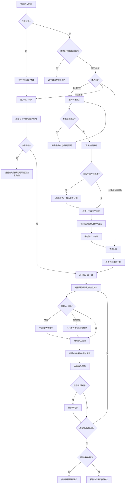
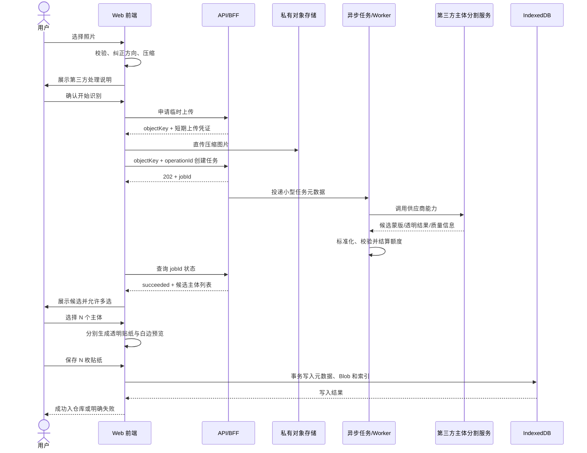

# 拾页 SHIYE 产品需求文档（PRD）

> 文档版本：V1.5  
> 文档状态：首发 Web 产品需求基线  
> 更新日期：2026-09-08  
> 产品名称：“拾页 SHIYE”为暂定名称，尚未最终确认。  
> 适用对象：产品、交互、视觉、前端、Serverless/API、测试与项目负责人。

## 0. 文档说明

### 0.1 事实与决策标记

- 【已确认/页面事实】：来自产品负责人明确需求，或现有原型中可直接观察、可复核的内容。
- 【合理推断】：为使已确认流程能够闭环而推导出的必要逻辑，仍可能被后续决策调整。
- 【建议设计】：为提升可用性、稳定性、隐私、成本或实现质量提出的方案，尚不是最终业务承诺。
- 【未知/尚未确认】：当前证据或决策不足，需由产品负责人或技术评估后确定。

### 0.2 依据与边界

【已确认/页面事实】本文以产品负责人提供的需求和以下现有原型文件为依据：index.html、styles.css、app.js、README.md。现有原型用于说明结构、视觉方向和交互验证，不代表其中的数量、阈值、动画时长、存储方式或技术实现已经最终确认。

【已确认/页面事实】本文不声称知道任何未展示的第三方 API、隐藏提示词、模型参数、供应商内部实现或私有技术架构。

【已确认/页面事实】V1.1 曾参考[《可研报告生成 PRD V2.0》](https://qiif643fw66.feishu.cn/wiki/JS7RwxlM2iq4IgkE1TycZRrHnJf)的文档组织方式，包括版本信息、术语、功能清单、非功能需求、评测和兜底策略；参考文档所属产品与“拾页”不同，其 Agent、报告生成、角色后台等业务内容不构成“拾页”需求。V1.2 另参考《AI Agent 产品上线部署手册》核对火山引擎部署边界；该手册是通用上线流程参考，不自动构成拾页的产品、账号或数据架构要求。

### 0.3 版本信息与变更日志

| 日期 | 文档版本 | 变更人 | 主要变更 |
|---|---|---|---|
| 2026-08-25 | V1.0 | Song / Codex | 建立 MVP 需求基线；完成产品范围、功能规则、数据模型、API 流程和核心验收标准 |
| 2026-08-27 | V1.1 | Song / Codex | 参考外部 PRD 的写作骨架进行缺口审计；补充术语表、用户任务、流程图、交付矩阵、状态模型、埋点字典、非功能需求、评测方案、兜底策略、风险与依赖 |
| 2026-09-03 | V1.2 | Song / Codex | 首发调整为响应式全栈 Web；加入邀请码、手机号登录、云同步、会员兑换码、管理员后台、一句话选主体、AI 文案与会员 AI 排版；确定后续通过火山引擎 veFaaS 部署 |
| 2026-09-03 | V1.3 | Song / Codex | 明确邀请码绑定、纯短信登录、游客额度与作品导入、会员额度和兑换叠加；补齐页面 revision/AI 元数据、TOS 直传与异步任务、AI 排版新页面合同和上线合规闸门 |
| 2026-09-07 | V1.4 | Song / Codex | 根据 Song 确认统一四项开发基线：已有手帐先翻阅再主动编辑；首发不增加自动分类、贴纸包、画笔和作品导出；一句话按图继承额度；退出保留本地作品并隔离账号访问。同步对应状态、数据边界和验收条目，不代表功能已经实现 |

### 0.4 术语表

【建议设计】以下术语作为产品、设计、开发和测试的统一语言：

| 术语 | 定义 |
|---|---|
| 主体 | 用户照片中希望提取的人物、动物、建筑、食物或其他独立对象 |
| 候选主体 | 分割服务返回、等待用户确认的一个对象蒙版；候选不等于已生成贴纸 |
| 贴纸资产 | 已生成并保存的透明主体图片、白边参数、名称和元数据，可被重复引用 |
| 贴纸实例 | 放置在某一手帐页面上的贴纸元素，包含位置、尺寸、角度和层级；删除实例不删除资产 |
| 个人贴纸仓库 | 属于用户的贴纸资产集合，初始为空；游客仅在当前浏览器，登录后可同步云端 |
| 官方贴纸库 | 产品内置的只读素材集合；不是社区，用户需主动加入个人仓库后使用 |
| 手帐 / 书 | 包含封面、书名、有序页面和编辑状态的结构化对象，本地优先并可在登录后同步 |
| 页面 | 手帐内的独立编辑单元，拥有自己的纸张和元素列表 |
| 元素 | 页面上的贴纸实例或文字对象 |
| 归架 | 用户主动结束当前编辑、确认保存并把手帐返回私人书架的产品动作 |
| local-first | 编辑中的业务数据优先落在当前浏览器；登录用户的手帐、贴纸与结构化数据再异步同步云端，完整原图不作为长期云资产 |
| 结构化页面 | 以 JSON 和独立 Blob 保存页面、元素与资产引用，而非整页合成图 |
| 轻量 2.5D | 使用 CSS 透视、位移、旋转、缩放和阴影模拟空间感，不使用真实 3D 模型 |
| Serverless 代理 | 保护第三方密钥、执行校验、限流和响应标准化的轻量服务端接口 |
| 幂等键 | 标识一次处理请求的稳定标识，用于避免重试产生重复贴纸或重复计费 |
| 软删除 | 从个人仓库中隐藏资产，但在页面仍引用时保留底层 Blob，避免破坏历史手帐 |
| 访问邀请码 | 发给一个潜在用户的预注册通行凭证；绑定手机号前可在不同浏览器验证进入，最终只能绑定一个手机号账号；绑定后立即失效 |
| 邀请访问凭证 | 浏览器验证未绑定邀请码后获得的服务端签发凭证，引用 inviteCodeId 而不保存明文邀请码；邀请码绑定手机号后，相关凭证全部失效 |
| 会员兑换码 | 管理员生成、用户兑换后获得会员期限和 AI 权益的凭证；首版不接在线支付 |
| 视觉定位 | 多模态视觉模型把“一句话选择主体”转换为点或边界框，不直接替代像素级分割 |
| AI 排版方案 | 模型返回的结构化页面布局参数；必须可预览、应用、继续编辑和撤销，不是整页合成图片 |
| 用量账本 | 服务端按用户、能力、模型和请求记录额度占用、费用、成功或失败状态的不可变明细 |
| 有效 AI 结果 | 已通过服务端结构和业务校验、能够展示给用户选择的预览或蒙版；用户最终放弃不改变其有效性 |

### 0.5 需求事实来源

| 来源 | 可支持的结论 | 不能证明的内容 |
|---|---|---|
| Song 的产品需求与后续确认 | 产品定位、MVP 范围、多主体、官方贴纸库、逐页纸张、页面管理、重命名和删除 | 未明确的供应商、阈值、品牌定稿和商业目标 |
| index.html / styles.css / app.js / README.md | 当前原型结构、可见控件、视觉方向和已模拟交互 | 正式 API、IndexedDB、真实多主体质量和最终参数 |
| 外部参考 PRD | 文档组织、验收、非功能、评测和兜底的写作方法 | “拾页”的业务功能、角色权限或内部架构 |
| 《AI Agent 产品上线部署手册》 | veFaaS、API 网关、TOS、Secret 和上线检查的部署参考 | 不自动决定拾页的登录模型、数据库可靠性、应用拆分、权限范围或上线验收标准 |
| 后续技术选型与测试 | API 能力、性能、成本、浏览器兼容和容量阈值 | 尚未实施前的真实线上结果 |

---

### 0.6 2026-09-08 交互升级确认

【已确认/页面事实】Song 确认：自动识别所有主要物体是主流程；圈选漏提或错提物体后，由真实分割自动贴边，再确认生成。手动描边裁切不是主流程，也不是自动贴边的实现。不同主体分别保存，不合并。当前本地原型未接入真实 AI。

- 仓库提供“进入创作”；贴纸提供“用于创作”；预览提供“收藏并用于创作”。必须先保存资产，成功后跳转。来自编辑器的流程返回同一本书、同一 pageId；来自首页的流程选择已有书或新建。
- 编辑器：贴纸匣拖入/点击；柔光选中、等比缩放角柄、独立旋转柄、双指缩放旋转；横竖文字；所有手势保留按钮替代，单次手势可撤销。
- 翻阅：桌面双页、手机竖屏单页；每一张纸有独立正反面，页角拖动可提交或回弹，支持封面、内封与封底。编辑仍是一页，不做跨书脊编辑。
- 正式验收须用代表性照片逐物体标注召回、错误和纠正后质量，不以“至少返回一个候选”代替“发现主要物体”。当前本地矩形/轮廓裁切仅供交互试用，不通过 AI 验收。

## 1. 产品概述

【已确认/页面事实】“拾页 SHIYE”是一款纯线上、轻量、私密的电子手帐产品。用户把旅行或生活照片转化为带白色描边的电子贴纸，将贴纸收藏到个人仓库，再放入可翻阅、可继续编辑的电子手帐中，并通过私人书架长期保存和重新打开。

【已确认/页面事实】产品不是普通图片编辑器。它的核心体验是：

照片变成贴纸 → 收入个人仓库 → 选择一本书 → 取书与开书 → 逐页创作 → 自动保存 → 合书归架 → 日后重新翻阅或继续编辑。

【已确认/页面事实】首发为同时适配手机和电脑浏览器的响应式 Web 产品，可进一步支持 PWA 安装。编辑数据优先保存在当前浏览器 IndexedDB；用户登录后，手帐、透明贴纸和结构化页面自动同步云端，完整原图默认不长期保存。

## 2. 产品背景与核心价值

### 2.1 背景

【合理推断】大量生活照片被保存在相册中，但缺乏再次整理、重组和表达当时感受的轻量方式。传统图片编辑器强调一次性产出图片，传统数字笔记又缺少贴纸、纸张、翻书和收藏的情绪价值。

### 2.2 核心价值

1. 【已确认/页面事实】把照片中的人物、动物、建筑、食物或其他主体转化为可复用贴纸。
2. 【已确认/页面事实】让同一贴纸可以跨手帐、跨页面重复使用。
3. 【已确认/页面事实】以“书”而不是“文件”的方式组织私人记忆。
4. 【已确认/页面事实】保留页面结构化可编辑性，不把整页渲染成不可编辑图片。
5. 【合理推断】通过取书、开书、创作、归架的仪式感，提高整理照片与再次翻阅的意愿。

## 3. 目标用户

### 3.1 核心用户

【合理推断】核心用户是希望私密保存旅行或生活记忆、喜欢纸张和贴纸美感，但不希望学习复杂设计软件的人。用户特征以行为和动机定义，不限定年龄或职业。

- 经常拍摄旅行、餐饮、宠物、人物或日常片段。
- 喜欢手帐、剪贴簿、收藏册或纸张质感。
- 需要低压力、低学习成本的个人表达工具。
- 更重视私密和长期可回看，而非公开传播。

### 3.2 典型用户类型

【合理推断】以下用户类型用于指导场景和验收，不代表已经完成定量用户研究，也不限定年龄、性别或职业。

| 用户类型 | 触发场景 | 现有行为 | 核心痛点 | 期望结果 |
|---|---|---|---|---|
| 旅行整理者 | 一次旅行结束或途中整理 | 拍摄大量人物、建筑、餐饮和风景照片 | 相册信息密集，普通拼图难以持续编辑和回看 | 快速提取多个主体，做成一本具有旅行叙事的手帐 |
| 日常收藏者 | 宠物、咖啡、花草、朋友聚会等日常积累 | 偶尔发社交平台或长期留在相册 | 公开分享有压力，照片缺少私人整理空间 | 把熟悉对象积累为可复用贴纸，持续记录生活 |
| 轻文字记录者 | 想记录一句话、一段心情或当天片段 | 使用备忘录或纸质手帐 | 普通笔记缺少纸张和收藏感，复杂设计工具成本过高 | 在空白或少量贴纸页面上快速写下内容并归架 |

### 3.3 Jobs to Be Done

【合理推断】

- 当我从一张照片中看到多个值得留下的对象时，我希望一次选择多个主体并分别做成贴纸，以便减少重复上传和处理。
- 当我整理一段旅行或日常记忆时，我希望自由组合可复用贴纸、纸张和文字，以便得到一本仍能继续编辑的私人手帐。
- 当我结束一次创作时，我希望明确知道内容已经保存并被放回书架，以便安心离开。
- 当我过一段时间回来时，我希望从私人书架重新打开原来的书，并回到上次的内容和页序。
- 当我使用第三方抠图能力时，我希望知道照片为何被发送、保存在哪里以及可能的风险。

### 3.4 非核心用户

【已确认/页面事实】首发不面向需要专业图片处理、公开内容运营、多人协作或商业印刷的用户。登录用户支持跨设备同步，但不承诺多人实时协作或同一手帐多端同时编辑。

## 4. 典型使用场景

1. 【合理推断】旅行结束后，用户从照片中选出人物、建筑、食物等主体，做成多枚贴纸并整理为旅行手帐。
2. 【合理推断】用户将宠物、咖啡、花草等日常照片持续积累为个人贴纸库，再分散使用到不同手帐。
3. 【合理推断】用户创建纯文字或少量贴纸页面，记录一段不适合公开分享的私人感受。
4. 【已确认/页面事实】用户从私人书架重新打开旧手帐，浏览、翻页或继续编辑。
5. 【已确认/页面事实】用户从官方贴纸库选择内置 Emoji 等官方素材，自行加入个人贴纸仓库。

## 5. 用户痛点

| 痛点 | 影响 | 产品回应 | 性质 |
|---|---|---|---|
| 相册照片很多，但缺少再创作动力 | 照片长期沉没 | 照片主体转为可复用贴纸 | 【合理推断】 |
| 专业图片编辑工具学习成本高 | 难以快速开始 | 聚焦贴纸、文字、纸张和页面的有限工具集 | 【合理推断】 |
| 一次性拼图不可继续编辑 | 后续修改成本高 | 保存结构化页面数据 | 【已确认/页面事实】 |
| 普通文件列表缺少情绪价值 | 不愿再次打开 | 私人书架和取书、开书、归架体验 | 【已确认/页面事实】 |
| 用户不愿公开私人生活 | 社交压力和隐私顾虑 | 无社区、无公开分享、local-first | 【已确认/页面事实】 |
| 游客本地数据可能被清理 | 长期保存存在风险 | 明示限制、登录同步入口、保存与同步状态反馈 | 【已确认/页面事实】+【建议设计】 |

## 6. 产品目标与非目标

### 6.1 产品目标

1. 【已确认/页面事实】完成从照片到贴纸、从贴纸到手帐、从手帐到书架的完整闭环。
2. 【已确认/页面事实】在桌面端和移动端完成基础响应式适配。
3. 【已确认/页面事实】保证页面保持可编辑，贴纸、文字、纸张和层级以结构化数据保存。
4. 【已确认/页面事实】使用 IndexedDB 优先保存本地图片和手帐数据。
5. 【已确认/页面事实】通过账号、会员额度、按需触发和管理员用量面板控制 AI 成本，并支持登录用户跨设备恢复。
6. 【已确认/页面事实】提供一句话选主体、AI 文案生成/润色和会员 AI 自动排版，同时保证所有结果由用户确认后应用。
7. 【已确认/页面事实】建立管理员与普通用户的服务端权限隔离，支持邀请码、兑换码、模型接口、账号与用量管理。

### 6.2 非目标

【已确认/页面事实】首发明确不做：

- 实体手帐和打印服务
- 用户社区、用户公开贴纸、公开分享和社交功能
- 多人协作
- AI 自动生成整本手帐
- AI 重绘贴纸
- 复杂图片滤镜
- 真正的 3D 书本系统
- 原生 iOS 或 Android App
- 多管理员分级审批和复杂组织权限
- 网页内在线支付
- 自动续费订阅
- 贴纸自动分类、自定义贴纸包
- 手帐绘画画笔
- 用户作品导出（单页、整本或贴纸文件的用户侧导出入口）

【已确认/页面事实】首发保留本 PRD 原已确认的核心能力，不因新版设计或原型出现额外控件而扩展范围；上述自动分类、自定义贴纸包、画笔和作品导出留待后续版本另行确认。2026-09-08 更新：手帐绘画画笔与逐像素高级蒙版精修仍不纳入首发；用于漏提、错提纠正的手绘大致轮廓＋AI 自动贴边已确认纳入主体补救，不受绘画画笔排除条款限制。用户作品导出不包含既有管理员邀请码/审计导出，也不等于取消账号数据权利处理入口。

【建议设计】整本手帐文件导入不纳入首发；登录后的游客作品选择导入和自动云同步属于本期，完整原图长期云备份不属于本期。

## 7. 完整用户旅程

### 7.1 新用户主旅程

1. 内测用户首次进入时输入访问邀请码；未绑定的邀请码可在不同手机、电脑和浏览器验证进入，每个浏览器获得独立游客访问资格；已有账号用户可直接走手机号验证码登录，不受邀请码入口阻挡。
2. 用户进入首页，理解“照片变贴纸、回忆进书本”的价值；未登录也可开始本地创作。
3. 用户进入贴纸工坊并上传照片，确认第三方图片处理说明。
4. 系统通过服务端代理请求自动主体分割，展示一个或多个候选主体。
5. 用户可多选候选；漏提或提错时，可点选、框选、画大致轮廓或一句话描述，重新分割并预览贴边结果。
6. 每个选中主体分别生成一枚透明背景贴纸，不合并为组合贴纸；用户逐枚调节白边并保存到个人仓库。
7. 用户也可浏览官方贴纸库，把需要的官方贴纸加入个人仓库。
8. 用户选择封面并创建新手帐，经过可跳过的轻量 2.5D 开书动画进入第一页。
9. 用户选择纸张，添加并编辑贴纸与文字；可自行写文案，也可让 AI 根据当前页贴纸缩略图、日期、地点、心情和可选草稿生成或润色短文案。
10. 会员可选择“自动选择、留白记录、杂志拼贴、随性手帐”之一生成 AI 排版预览；确认后才应用，并可一键撤销。
11. 用户新增、切换、排序或删除页面；纸张按页面独立保存。
12. 编辑内容先自动保存到当前浏览器；需要完整 AI 月度权益、会员兑换或跨设备同步时，只使用手机号短信验证码注册/登录，不设置账号密码。
13. 注册时邀请码与该手机号账号原子绑定并立即失效；登录后先由用户选择是否导入当前浏览器的游客手帐和贴纸，确认导入的作品成功形成云端副本后再标记归属账号，不长期同步完整原图。
14. 用户点击“合上并归架”，系统完成本地保存并安排云同步后播放归架动画，返回私人书架。

### 7.2 回访用户旅程

1. 已通过邀请码的游客可直接进入当前浏览器的私人书架；邀请码绑定手机号后，用户在任何设备均改用手机号验证码登录，不能再用原邀请码进入游客模式。
2. 系统先确定当前游客或已登录账号的可访问范围，再读取该范围内的本地最新版本；仅为已登录账号拉取其云端版本并按 revision 检查。检测到并发冲突时保留双版本，不静默覆盖；退出后的账号缓存不作为游客作品显示。
3. 【已确认/页面事实】用户从书架打开已有手帐，默认进入干净的翻阅状态；用户主动点击“编辑”后才出现编辑工具并允许修改。翻阅时不允许拖动、删除或修改页面内容；本规则替代此前“不设置独立只读模式”的要求。新建空白手帐仍可直接进入编辑，不增加无意义的二次确认。
4. 修改先本地自动保存，联网且已登录时再异步同步；归架不因短时断网而丢失本地内容。

### 7.3 非强制顺序

【建议设计】导航不强制用户严格按顺序完成。个人仓库为空时仍可创建纯文字手帐；但新用户主 CTA 和区块文案应引导其完成完整仪式链路。

### 7.4 用户旅程流程图

【建议设计】以下流程图用于统一产品、设计、开发和测试对主要分支的理解：

### 7.5 阶段完成门槛

【建议设计】动画、提示文案或按钮状态不能单独证明步骤完成；每一阶段按真实结果定义：

| 阶段 | 完成条件 | 不应被视为完成 |
|---|---|---|
| 图片接收 | 文件通过校验且浏览器成功解码 | 仅选择了文件名 |
| 主体识别 | 至少一个候选蒙版可供用户查看和选择 | API 返回 200 但候选为空或无法渲染 |
| 贴纸生成 | 透明主体和白边预览均可用 | 只有处理动画结束 |
| 存入仓库 | 元数据与 Blob 在同一业务操作中写入成功并可读回 | 仅更新前端列表 |
| 新建手帐 | Book 与第一页已写入本地库；登录用户进入待同步队列 | 仅选中了封面 |
| 自动保存 | 当前 revision 的相关记录成功提交 | 显示了“正在保存”或旧 revision 成功 |
| 归架 | 强制保存成功且书架索引已更新 | 只播放了合书/归架动画 |
| 重新打开 | 书、页序、页面和资产引用均能解析 | 只打开了空编辑器外壳 |

## 8. 信息架构

### 8.1 用户端结构

【已确认/页面事实】首发用户端保留连续旅程式首页；编辑器和书架可使用独立路由，以适配桌面和移动端复杂状态：

1. 首页与产品价值区
2. 贴纸工坊
3. 贴纸仓库区：个人贴纸仓库、官方贴纸库
4. 选书区
5. 取书/开书与编辑台
6. 私人书架
7. 页脚与本地存储说明入口
8. 邀请码验证、登录、会员兑换和账号设置

### 8.2 管理端结构

【已确认/页面事实】管理员通过独立 `/admin` 入口访问后台。首版包含：概览、邀请码、会员兑换码、模型接口、账号与用量、审计日志。管理员页面不混入普通用户的手帐编辑旅程。

### 8.3 顶部导航

【已确认/页面事实】顶部导航至少包含：贴纸工坊、选一本、编辑台、我的书架。品牌标识返回首页。

【建议设计】导航点击采用锚点滚动；当前区块高亮。减少动态效果时改为立即跳转。

## 9. MVP 功能范围

| 模块 | MVP 能力 | 性质 |
|---|---|---|
| 产品框架 | 单页面 Web、滚动和顶部导航 | 【已确认/页面事实】 |
| 图片输入 | 本地图片选择、格式与大小校验、方向纠正、客户端压缩 | 【已确认/页面事实】+【建议设计】 |
| 主体分割 | 第三方能力、候选主体、多主体选择、分别生成贴纸 | 【已确认/页面事实】 |
| 贴纸生成 | 透明背景、白色描边、宽度调节、预览 | 【已确认/页面事实】 |
| 贴纸资产 | 个人仓库、官方贴纸库、加入、复用、重命名、删除 | 【已确认/页面事实】 |
| 新建手帐 | 多种封面、新手帐创建、书名 | 【已确认/页面事实】+【建议设计】 |
| 仪式动画 | 取书、居中、开封面、第一页、归架 | 【已确认/页面事实】 |
| 页面 | 多种纸张、逐页独立纸张、新增、切换、排序、删除 | 【已确认/页面事实】 |
| 贴纸编辑 | 选择、移动、缩放、旋转、层级、复制、删除 | 【已确认/页面事实】 |
| 文字编辑 | 创建、二次编辑、有限字体、移动、缩放、旋转、复制、删除 | 【已确认/页面事实】+【建议设计】 |
| 保存 | IndexedDB、结构化数据、自动保存和状态反馈 | 【已确认/页面事实】 |
| 书架 | 浏览、重命名、删除；已有手帐重开先翻阅，主动切换后编辑 | 【已确认/页面事实】 |
| 适配 | 桌面端和移动端基础响应式、减少动态效果 | 【已确认/页面事实】 |
| 邀请与账号 | 首次访问邀请码、游客模式、手机号短信注册/登录、账号状态 | 【已确认/页面事实】 |
| 云同步 | 登录后同步手帐、透明贴纸与结构化页面；完整原图不长期保存 | 【已确认/页面事实】 |
| AI 选主体 | 一句话视觉定位，点选/框选交互分割，漏选补救 | 【已确认/页面事实】 |
| AI 文案 | 自行输入，或基于当前页贴纸缩略图、日期、地点、心情生成/润色 | 【已确认/页面事实】 |
| AI 排版 | 会员专属；四种风格、最多 3 个候选、预览、应用和撤销 | 【已确认/页面事实】 |
| 会员 | 兑换码开通，首版不接在线支付；服务端维护权益与额度 | 【已确认/页面事实】 |
| 管理后台 | 邀请码、兑换码、模型接口、账号、用量、停用和审计日志 | 【已确认/页面事实】 |

## 10. 明确不做的范围

【已确认/页面事实】除第 6.2 节所列非目标外，首发多主体选择仍不包含：

- 逐像素高级蒙版精修（不包含已确认的圈选纠错）
- 套索选区
- 擦除和恢复边缘
- 把多个分离主体合并为一枚组合贴纸
- 任意开放式图像问答或与选主体无关的提示词

【建议设计】游客不承诺浏览器数据恢复或跨设备一致性；登录用户提供云同步，但首发不支持同一本手帐多人协作或多端同时编辑。

## 11. P0、P1、P2 优先级

### 11.1 定义

- P0：没有该能力就无法完成主旅程或会造成数据/隐私严重风险，发布阻断。
- P1：属于已确认 MVP，影响完整性和可管理性，应在 MVP 发布前完成；可在开发排期中晚于 P0。
- P2：不阻断 MVP 主流程的体验打磨或后续候选，不得挤占 P0/P1。

### 11.2 优先级清单

| 优先级 | 功能 |
|---|---|
| P0 | 邀请码访问、游客模式、手机号短信注册/登录、退出与账号注销申请、服务端权限隔离、图片直传与异步任务、自动主体候选、多主体选择、点选/框选/轮廓提示重新分割、一句话选主体、透明贴纸、白边调节、个人仓库、创建手帐、逐页编辑、本地自动保存、登录后云同步、AI 文案生成/润色、会员 AI 排版预览/应用/撤销、归架与书架重开、会员兑换码、管理员四类管理能力、错误反馈、隐私说明、移动/桌面核心流程 |
| P1 | 官方贴纸库与加入、贴纸和手帐重命名/删除、完整层级控制、复制、页面排序/删除、加载取消、API 有限重试与降级、存储预警、键盘可访问性、低性能降级、模型成本看板、审计日志筛选导出 |
| P2 | 动画和纹理精修、候选排序优化、逐像素高级蒙版精修（不包含圈选纠错）、快捷键提示、性能监测优化、在线支付、自定义域名、更多排版风格和多管理员细粒度权限 |

### 11.3 里程碑定义

【建议设计】里程碑用于拆分交付，不改变 P0/P1 均属于 MVP 的范围定义。

| 里程碑 | 目标 | 完成门槛 |
|---|---|---|
| M0 技术验证 | 验证多主体、白边、IndexedDB Blob 和移动画布可行性 | 代表性样本可完成“候选 → 贴纸 → 本地读回”；关键性能风险有结论 |
| M1 贴纸闭环 | 完成上传、候选选择、贴纸生成和仓库 | 从空状态可生成并保存多枚贴纸；刷新后可读取 |
| M2 手帐闭环 | 完成新建书、逐页编辑、自动保存 | 可用个人/官方贴纸和文字制作多页手帐；刷新后构图一致 |
| M3 AI 与账号闭环 | 完成邀请码、登录、云同步、AI 文案/排版/选主体、会员兑换和管理员后台 | 权限、额度、预览应用、撤销、用量账本和数据隔离通过验收 |
| M4 归架与发布 | 完成书架、重开、管理、异常、响应式、无障碍和 veFaaS 部署准备 | 正常与失败路径通过验收，发布门槛全部满足 |

### 11.4 功能交付清单

【建议设计】负责人为角色而非具体人员；具体姓名和目标日期在排期会中补齐。

| 一级模块 | 二级功能 | 单句验收 | 优先级 | 里程碑 | 主责任 | 关键依赖 | 目标日期 |
|---|---|---|---|---|---|---|---|
| 页面框架 | 单页导航 | 用户可通过导航和滚动到达四个主要功能区，当前区块可识别 | P0 | M1 | 前端/设计 | 页面结构 | 待排期 |
| 图片输入 | 上传与校验 | 非法文件不请求 API，合法图片可正确解码和预览 | P0 | M1 | 前端 | 格式与大小配置 | 待排期 |
| 主体分割 | 候选识别 | 代表性多对象照片可返回并展示多个可选候选 | P0 | M0/M1 | Serverless/前端 | 第三方能力、代理契约 | 待排期 |
| 主体分割 | 多主体选择 | 用户可多选并分别生成 N 枚独立贴纸 | P0 | M1 | 前端 | 候选蒙版 | 待排期 |
| 贴纸生成 | 白边与预览 | 白边变化即时反映，保存结果与最终预览一致 | P0 | M1 | 前端 | Canvas/图像处理 | 待排期 |
| 个人仓库 | 保存与复用 | 贴纸可刷新读回，并在不同书和页面重复使用 | P0 | M1 | 前端 | IndexedDB | 待排期 |
| 官方贴纸库 | 加入个人仓库 | 用户主动加入后可使用，重复操作不产生意外副本 | P1 | M2 | 前端/设计 | 官方素材清单 | 待排期 |
| 资产管理 | 重命名与删除 | 重命名持久化，删除在用贴纸不破坏历史页面 | P1 | M3 | 前端 | 引用计数、软删除 | 待排期 |
| 手帐创建 | 封面与新书 | 确认取书时只创建一本含一页的新手帐 | P0 | M2 | 前端 | Book/Page 模型 | 待排期 |
| 编辑画布 | 贴纸变换 | 鼠标和触控均能移动、缩放、旋转及调整层级 | P0/P1 | M2 | 前端/设计 | 画布坐标系统 | 待排期 |
| 文字 | 创建与二次编辑 | 文字可创建、修改内容、变换、复制和删除 | P0 | M2 | 前端 | 字体回退策略 | 待排期 |
| 页面 | 新增、切换、排序、删除 | 页序正确持久化，最后一页不可删除，有内容删除需确认 | P0/P1 | M2 | 前端 | Page 模型 | 待排期 |
| 保存 | IndexedDB 自动保存 | 当前 revision 保存成功后才显示已保存，失败可重试 | P0 | M2 | 前端/测试 | IndexedDB、迁移 | 待排期 |
| 仪式动画 | 取书、开书、归架 | 默认、跳过和减少动态三条路径落入相同正确状态 | P0 | M3 | 前端/设计 | 状态机、性能降级 | 待排期 |
| 私人书架 | 浏览与重开 | 归架后书本可见，重新打开时数据与资产引用完整 | P0 | M3 | 前端 | Book 索引、Blob 引用 | 待排期 |
| 手帐管理 | 重命名与删除 | 重命名持久化；永久删除有明确确认且不误删其他数据 | P1 | M3 | 前端/测试 | 引用清理 | 待排期 |
| 可靠性 | 错误、离线、限流、空间不足 | 每类关键失败均有正确提示、恢复动作和数据保留策略 | P0/P1 | M3 | 前端/Serverless/测试 | 错误分类、监控 | 待排期 |
| 适配 | 移动端与无障碍 | 移动端不依赖双指手势即可完成主流程，键盘与减少动态可用 | P0/P1 | M3 | 前端/设计/测试 | 目标浏览器矩阵 | 待排期 |
| 邀请与登录 | 访问资格和手机号账号 | 邀请码只在首次访问验证；注册后手机号验证码可正常登录且绑定邀请来源 | P0 | M3 | 后端/前端 | 短信资质、鉴权 | 待排期 |
| 云同步 | 跨设备恢复 | 登录用户可在另一浏览器恢复手帐和透明贴纸，冲突不静默覆盖 | P0 | M3 | 后端/前端 | 数据库、对象存储 | 待排期 |
| 主体补救 | 点/框/轮廓/一句话 | 自动漏选或错选时点、框、轮廓和一句话均能生成新的可确认候选 | P0 | M3 | AI/后端/前端 | 视觉定位、分割服务 | 待排期 |
| AI 文案 | 生成与润色 | 仅使用当前页约定输入，先预览后应用，额度与失败不扣规则正确 | P0 | M3 | AI/后端/前端 | 多模态/文本模型 | 待排期 |
| AI 排版 | 会员结构化布局 | 四种风格、最多三个候选、锁定元素、预览、应用和撤销完整 | P0 | M3 | AI/后端/前端 | 布局 Schema、会员权益 | 待排期 |
| 管理后台 | 四类管理能力 | 管理员可管理邀请码、兑换码、模型、账号和用量；普通用户接口拒绝 | P0 | M3 | 后端/前端/测试 | RBAC、审计日志 | 待排期 |

## 12. 功能详细规则

### 12.0 功能说明阅读方式

【建议设计】每个功能在设计与开发拆解时至少补齐以下字段：入口、前置条件、用户动作、系统行为、成功产出、空/加载/错误状态、数据写入、埋点和验收标准。本文将通用状态集中在第 19 节、埋点集中在第 21 节，以避免在每个功能中重复；实施任务不得只引用视觉原型而遗漏这些规则。

### 12.1 图片上传

【合理推断】用户从设备选择一张图片；MVP 未要求相机实时拍摄，因此不纳入本期交互。

【建议设计】

- 支持 JPG、PNG、WebP；HEIC/HEIF 是否支持取决于浏览器解码和成本，暂标待决策。
- 单文件大小、最大像素、压缩长边和输出分辨率由配置控制，正式数值待技术与成本测试。
- 上传前检查 MIME、扩展名、文件头、尺寸和解码结果。
- 客户端纠正 EXIF 方向，并在不明显影响边缘质量的前提下降采样。
- 当前仅处理单张照片；用户可完成后继续上传下一张。
- 原图不得直接放入 localStorage。

### 12.2 多主体识别与选择

【已确认/页面事实】一张照片可选择多个主体，每个主体分别生成一枚贴纸。

【建议设计】

- 服务返回候选蒙版、边界框和可选质量信息；供应商字段通过代理适配，不暴露给前端。
- 前端过滤面积过小、置信度过低和高度重复的蒙版。
- 目标是发现照片中所有主要物体，不以固定 6 个静默截断主要物体。候选多时分批或列表展开；供应商上限及召回率必须实测，不能承诺任意照片 100% 提全。
- 默认预选质量最高且面积合理的主体，但必须让用户看见并确认。
- 候选在原图上以轮廓或半透明蒙版显示；点击切换选中状态。
- 至少选择一个主体后才能进入贴纸预览。
- 多选结果分别生成，不在 MVP 中自动合并。
- 自动候选漏提或提错时，P0 提供点选、框选、圈选轮廓和一句话描述补救。圈选只需大致包围目标，再由交互分割自动贴合真实边缘；新蒙版须预览确认。
- 点选/框选提示直接送入交互分割能力；一句话先经多模态视觉模型转换为一个或多个点/边界框，再调用分割能力获得精确蒙版。
- 一句话定位只作为候选建议；用户仍需在原图上确认结果，不直接保存。
- 免费注册用户每张图片最多 3 次一句话选主体，会员每张图片最多 10 次；系统失败、超时或无有效结果不扣次数，超额后仍可使用点选和框选。
- 【已确认/页面事实】注册后同一张图片继承游客阶段在该图上的已用次数，不因注册重新发放；新图片使用当前账号对应的每图额度。一句话选主体不设本月重置，不把其他图片的历史次数扣到新图上。刷新或重新进入同一张图不能清空已用次数；会员每图 10 次是该图的总上限，不是在已用次数之上再加 10 次。
- 旧请求响应必须携带 imageSessionId、sourceRevision；用户换图或修改提示后，过期响应不得覆盖当前结果。

### 12.3 白边与贴纸生成

【已确认/页面事实】每枚透明主体增加白色描边，用户保存前可调节宽度。

【建议设计】

- 白边由浏览器基于 alpha 蒙版生成，减少供应商耦合。
- UI 提供窄、自然、宽三个快捷档，并提供连续滑杆；若技术排期受限，三个离散档可作为 P0，滑杆为 P1。
- 多主体预览时，用户逐枚切换或批量使用同一白边值。
- 保存的是最终贴纸资产与描边参数；页面实例只引用贴纸资产。
- MVP 不支持保存后回到工坊重新编辑旧贴纸白边。

### 12.4 个人贴纸仓库

【已确认/页面事实】个人仓库初始为空，支持复用、重命名和删除。

【建议设计】

- 新贴纸默认名称为“我的贴纸 N”，用户可在保存时或仓库中修改。
- 名称去除首尾空格，不允许空名称；最大长度待视觉验证，建议 24 个中文字符以内。
- 仓库按最近加入倒序排列。
- 从个人仓库删除贴纸时：若仍被页面引用，只移出仓库并保留底层资产；若无引用，才能清理 Blob。
- 删除前提示引用情况，不从已有手帐页面级联删除。
- 同一贴纸可跨手帐、跨页面创建多个实例。

### 12.5 官方贴纸库

【已确认/页面事实】原型 Emoji 贴纸归入官方贴纸库，用户自行选择是否加入个人仓库。

【建议设计】

- 官方贴纸库是产品内置只读素材，不是用户社区。
- 用户不能上传到官方库、评价或公开分享。
- “加入个人仓库”应具有幂等性，重复点击不产生重复副本，除非用户明确选择复制。
- 用户可修改个人副本名称或删除个人副本，不影响官方资产。

### 12.6 新建手帐与封面

【已确认/页面事实】用户选择多种封面或手帐样式，并通过取书动作进入编辑。

【建议设计】

- 点击“从书架取下这本书”时才创建新手帐记录，单纯浏览封面不创建垃圾草稿。
- 新手帐包含稳定 ID、默认书名、一页空白页、所选封面和时间字段。
- 是否允许同一本书后续更换封面尚未确认；MVP 建议允许在编辑顶部打开封面设置，但不作为 P0。
- 书名允许重命名，空值回退为默认书名。

### 12.7 取书、开书与归架

【已确认/页面事实】采用轻量 2.5D 动画，不实现真实 3D 模型。

【建议设计】

- 取书到稳定书页总时长约 1.6–2.0 秒，具体分段见产品设计文档；已有手帐落在翻阅状态，新建手帐落在编辑状态。
- 动画中锁定编辑操作并显示“跳过”。正常、跳过和减少动态效果都遵循同一模式规则，不能因跳过而让已有手帐直接进入编辑。
- 减少动态效果时使用约 150ms 淡入，不使用旋转、翻页或漂浮。
- 低性能设备降低阴影、透视和同时运动元素数量。
- 点击“合上并归架”先强制保存；保存成功后播放归架。保存失败时不得制造“已安全归架”的错误认知。
- 关闭浏览器无法保证播放动画，但应尽力执行本地保存。

### 12.8 纸张

【已确认/页面事实】纸张按页面独立保存。

【已确认/页面事实】原型展示空白、点阵、方格和横线四种纸张；这些样式可作为 MVP 初始集合，但数量尚未被单独确认为最终值。

【建议设计】切换纸张只改变当前页背景，不影响该页元素，不改变其他页面。

### 12.9 贴纸画布操作

【已确认/页面事实】贴纸支持移动、缩放、旋转、层级调整、复制和删除。

【建议设计】

- 单击或单击触摸选择元素；点击画布空白取消选择。
- 拖动移动；元素中心不得完全移出安全画布，但允许局部越界形成剪贴效果。
- 桌面端使用控制柄或工具条缩放、旋转；移动端使用拖动和底部工具条，增加双指等比缩放与旋转，同时保留单指和按钮替代操作。
- 缩放应设最小和最大值，具体数值需视觉验证。
- 旋转以元素中心为轴；工具条可按固定步长旋转，直接控制柄连续旋转。
- 层级包括上移一层、下移一层、置顶、置底。
- 复制生成新元素 ID，位置轻微偏移，资产仍引用同一贴纸。
- 删除只删除当前页面实例，不删除仓库资产。

### 12.10 文字创建与编辑

【已确认/页面事实】文字采用有限样式，不做复杂富文本。

【建议设计】

- 用户输入非空文字后添加到当前页；保留换行。
- 支持手写感、宋体、简洁无衬线三种字体风格作为初始方案。
- 单击选中文字，双击或点击“编辑文字”进入内容编辑。
- 文字元素支持移动、缩放、旋转、层级、复制和删除。
- MVP 不支持同一文本框内混合字体、局部加粗、链接、列表或复杂排版。
- 字体缺失时使用明确的系统回退字体，避免布局不可控。

### 12.10A AI 文案生成与润色

【已确认/页面事实】用户始终可以自行输入；AI 是明确可选项，不自动调用。输入为空时提供“帮我写一段”，已有草稿时提供“帮我润色”。

【已确认/页面事实】AI 只读取当前页贴纸的低分辨率缩略图，以及用户选择或填写的日期、粗粒度地点、心情和可选草稿；不重新读取整本手帐，也不再次读取完整原图。地点默认手动输入或选择，不默认读取精确 GPS。

【建议设计】首版输出 40–100 个中文字符，提供自然记录、温柔手帐、简短克制三种语气。生成结果先进入预览，用户可以应用、修改、放弃或重新生成；应用后只是普通可编辑文字元素。

【已确认/页面事实】免费注册用户每月 10 次，会员每月 100 次；“每月”统一按北京时间（Asia/Shanghai）自然月计算，每月 1 日 00:00 重置且不结转。当月升级会员后，文案额度上限提升为当月总计 100 次，升级前及同邀请码游客阶段已使用次数包含在内，不额外叠加 100 次。

【已确认/页面事实】成功返回通过校验、可供用户选择的文案预览即扣一次；用户放弃或不应用仍计次，重新生成另计。系统失败、超时、空结果或结构校验失败不扣用户额度，手工编辑不计次。

### 12.10B 会员 AI 自动排版

【已确认/页面事实】AI 自动排版是会员权益，每位会员每个北京时间自然月共 30 次，不结转。一次调用最多返回 3 个候选方案；成功返回至少一个通过校验且可渲染的候选即扣一次，用户放弃仍计次；切换同批候选不重复扣次，重新发起生成才扣次；系统失败、超时或全部候选结构校验不通过不扣用户额度。

【已确认/页面事实】入口分为“智能排版新页面”和“重新排版当前页”。风格包含自动选择、留白记录、杂志拼贴、随性手帐。

【已确认/页面事实】“智能排版新页面”由用户先选择要放入的个人贴纸和已有文案；AI 不读取整个贴纸仓库，不自行选择素材，不生成、改写或删除文字。生成候选期间不创建正式页面，只有用户应用某一候选时才在当前页之后创建新页面。

【建议设计】模型只返回结构化 JSON：推荐 paperId，以及用户已选元素的 x/y/scale/rotation/zIndex 和允许范围内的样式参数；不返回不可编辑的整页图片。普通程序必须校验元素/资产 ID、坐标范围、碰撞、安全区和锁定状态。重新排版当前页时，AI 不得新增、删除或修改文字内容，只能安排未锁定元素并提出可预览的纸张建议。

【已确认/页面事实】已有手工内容必须先展示预览；用户选择应用或保留原版。应用前保存当前页面快照并提供一键撤销；locked=true 的元素不得被移动。请求包含 sourceRevision，生成期间页面变化时旧结果不得直接应用。

### 12.11 多页面管理

【已确认/页面事实】MVP 支持新增、切换、排序和删除页面。

【建议设计】

- 一本手帐至少保留一页。
- 新页面插入在当前页之后并自动切换到新页。
- 页面排序通过缩略图拖动；移动端可同时提供“前移/后移”。
- 删除有内容页面必须二次确认；空白页可一次确认。
- 删除当前页后优先打开前一页；若无前一页则打开新的第一页。
- 页面数量上限使用配置；原型的 20 页仅为参考，最终值待性能测试。

### 12.12 自动保存

【已确认/页面事实】编辑过程采用“本地先保存、登录后异步云同步”；IndexedDB 是离线编辑与即时恢复层，服务端是登录用户跨设备同步层。图片不存入 localStorage。

【建议设计】

- 内存状态变更后标记 dirty，停止输入或拖动约 800ms 后保存；具体时长可调。
- 页面切换、归架、文档进入隐藏状态和 pagehide 时立即尝试 flush。
- 每次只写入受影响的书、页面或资产，避免整库序列化。
- 保存状态至少包含：正在保存、已保存、保存失败、空间不足。
- 保存失败时保留内存编辑状态，显示重试，不应假装成功。
- 同一书记录 revision；新保存只能覆盖当前 revision，避免异步回写旧版本。
- 登录用户的本地事务成功后进入 syncQueue；网络恢复后按 operationId 幂等提交，云同步失败不把本地“已保存”误报为“已同步”。
- 状态至少区分：正在保存、已保存到本机、正在同步、已同步、同步失败。
- 同一本书在另一设备产生更高或分叉 revision 时，不使用最后写入覆盖；保留冲突副本并让用户选择。

### 12.13 私人书架

【已确认/页面事实】书架支持浏览、重新打开、继续编辑、重命名和删除。

【建议设计】

- 书按最近编辑时间排序。
- 书脊至少显示书名；封面、页数和更新时间在聚焦或详情中展示。
- 点击书本先加载本地最新记录；登录用户同时检查云端 revision 后进入开书流程。
- 删除手帐会删除本地记录，并为登录用户同步云端软删除；显示书名、页数和恢复边界后确认。
- 删除手帐时释放仅被该书引用且不在个人仓库中的孤立资产。

### 12.14 邀请、账号、会员与权限边界

【已确认/页面事实】内测阶段无账号访问者需要邀请码。一个邀请码对应一个未来账号：绑定手机号前可在不同手机、电脑和浏览器验证进入，每个浏览器的游客作品彼此独立；邀请码最终只能绑定一个手机号账号。已有账号用户始终可以直接进入手机号验证码登录，不得被邀请码门槛挡住。

【已确认/页面事实】游客可本地制作；使用完整 AI 月度权益、兑换会员或跨设备同步时，使用手机号与短信验证码注册/登录。开发环境使用明确隔离的测试验证码，生产环境只能使用审核通过的短信服务；测试验证码不得进入生产。

【已确认/页面事实】注册成功时，服务端将邀请码与当前手机号账号原子绑定并立即把邀请码置为已绑定；该邀请码不能再进入游客模式或绑定第二个手机号，关联的所有邀请访问凭证随即失效。后续注册和登录只使用手机号短信验证码，不设置账号密码。

【建议设计】每个浏览器验证邀请码后获得不含明文码的 inviteAccessGrant，并引用同一个 inviteCodeId。注册前不同浏览器产生的联网用量统一记在 inviteCodeId 名下；访问凭证过期时，只要邀请码仍未绑定、未过期且未停用，用户可再次输入该邀请码。邀请码验证本身不创建账号，也不使不同浏览器的本地作品互相同步。

【已确认/页面事实】游客在当前设备注册或登录后，先由用户选择是否导入本机手帐和贴纸，不未经确认自动上传。导入对象生成新的云端 ID，云端写入成功前保留本地副本；成功后才标记为归属当前账号。其他浏览器中的游客作品，需要用户分别在对应浏览器登录后导入。

【已确认/页面事实】退出登录保留当前账号已保存到本机的作品，但立即停止展示和访问其作品、贴纸与缩略图；再次登录同一账号后才可查看。游客与其他账号不能通过搜索、最近打开、历史页面、素材引用或同步队列访问这些账号数据。退出不等于注销或删除，保留本地数据也不承诺浏览器清理后的恢复。账号数据访问隔离不能只靠隐藏界面实现，具体技术措施见《拾页-AI与后端技术方案》第 5.1 节。

【已确认/页面事实】角色至少包含 guest、user、admin。管理员通过独立 `/admin` 入口访问；角色和资源所有权必须由服务端校验，不能靠隐藏前端按钮。初始管理员通过部署期安全配置或受控初始化创建，普通注册和邀请码均不能产生管理员。

【已确认/页面事实】首版不接在线支付。用户通过管理员生成的会员兑换码获得会员期限和 AI 权益；当前会员未到期时从原到期时间顺延，已过期或非会员从兑换成功时间起算，允许连续兑换多个有效码累计时长。额度由服务端维护；AI 文案和 AI 排版的月度额度按北京时间自然月重置且不结转，一句话选主体按每张图片计次，不按月重置。

【已确认/页面事实】邀请码未绑定手机号前，所有浏览器共享以下邀请码累计体验额度：自动主体识别 5 张照片、点选/框选/轮廓提示重新分割 10 次、一句话选主体 3 次、AI 文案 3 次；AI 自动排版不可用。额度耗尽不影响已有贴纸和手帐的本地编辑，只引导手机号注册。注册后，一句话选主体按第 12.2 节的每图规则继承同图已用次数，新图按账号每图额度计算；游客 AI 文案用量仍计入该账号注册当月的文案额度。两种能力不得合并为同一个月度额度。

【建议设计】管理员支持：

- 邀请码：单个/批量创建、有效期、备注、启停、验证记录、唯一绑定账号和导出；每个码只能绑定一个手机号账号，跨浏览器验证不消耗第二个绑定名额。
- 会员兑换码：会员类型、有效时长、最大兑换人数、启停、兑换记录；已兑换权益通过独立调整操作处理，不通过删除兑换码静默撤回。
- AI 接口：服务商、能力路由、模型名、主备优先级、超时、重试、限额、单价、健康检查、启停；密钥只写入服务端密钥配置，后台仅显示掩码。
- 账号与用量：邀请来源、会员状态、各能力额度、模型调用、估算/实际成本、云端对象数量与存储字节、启停账号和人工调整额度。
- 审计：记录管理员、时间、对象、动作和变更前后摘要；不得记录完整密钥、图片或手帐正文。

【建议设计】停用账号只阻止登录、云同步和 AI 调用，不自动删除其云端数据。管理员默认无权查看用户原图、贴纸像素和手帐正文；如未来需要客服排障访问，必须另立授权和审计流程。

## 13. 核心功能验收标准

| 编号 | 功能 | 验收标准 | 优先级 |
|---|---|---|---|
| AC-01 | 单页导航 | 顶部导航可到达四个主要功能区；当前区块可识别；返回首页可用 | P0 |
| AC-02 | 图片上传 | 合法图片可解码并进入处理；非法格式、超限或损坏文件给出明确错误且不调用 API | P0 |
| AC-03 | 多主体候选 | 一张含多个清晰对象的测试图可显示多个候选；用户可多选并取消选择 | P0 |
| AC-04 | 分别生成 | 选择 N 个主体后生成 N 枚独立贴纸，不自动合并；每枚均有唯一资产 ID | P0 |
| AC-05 | 白边预览 | 调节白边后预览即时更新；保存结果与最终预览一致 | P0 |
| AC-06 | 个人仓库 | 新贴纸可保存、显示、重命名、跨书复用；支持收藏后直达创作、收藏并使用与回到来源书页；刷新后仍存在 | P0/P1 |
| AC-07 | 官方贴纸库 | 官方贴纸不会自动进入个人仓库；用户加入后可使用；重复加入不会意外重复 | P1 |
| AC-08 | 删除贴纸 | 删除被页面使用的个人贴纸不破坏已有页面；无引用资产可被清理 | P1 |
| AC-09 | 新建手帐 | 选择封面并确认后只创建一本新手帐，包含一页且能进入编辑 | P0 |
| AC-10 | 开书动画与模式 | 正常、跳过、减少动态效果三条路径均为已有手帐进入翻阅、新建手帐进入编辑；已有手帐需主动点击“编辑”才出现工具 | P0 |
| AC-11 | 纸张 | 更改当前页纸张不改变其他页或现有元素；刷新后结果一致 | P0 |
| AC-12 | 贴纸编辑 | 鼠标与触控下可从贴纸匣拖入或点击添加；选中有柔光、缩放角柄和旋转柄；双指等比缩放旋转及按钮替代可用；保留复制、删除、层级 | P0/P1 |
| AC-13 | 文字 | 可创建、重编、横排/竖排切换、变换、复制和删除；竖排不以整块旋转替代；刷新后方向、内容与布局一致 | P0 |
| AC-14 | 页面管理 | 可新增、切换、排序、删除；不能删除最后一页；有内容删除需确认 | P0/P1 |
| AC-15 | 自动保存 | 正常编辑后状态依次为正在保存/已保存；强制刷新后恢复最后成功保存版本 | P0 |
| AC-16 | 保存失败 | 模拟 IndexedDB 拒绝或空间不足时显示失败，不显示“已保存”，用户可重试 | P0 |
| AC-17 | 归架 | 归架前完成保存；保存失败时停止成功归架语义；成功后书架出现或更新该书 | P0 |
| AC-18 | 重开 | 从书架打开默认翻阅；桌面双页、手机竖屏单页；同张纸正反面对应相邻且独立页面，含封面/内封/封底；页序与保存一致；翻阅不修改内容，进入编辑聚焦所选单页 | P0 |
| AC-19 | 删除手帐 | 二次确认后删除目标书，不误删其他书或个人仓库资产 | P1 |
| AC-20 | 响应式 | 目标桌面和移动宽度下主流程无横向功能丢失；触控目标可操作 | P0 |
| AC-21 | 减少动态 | 系统开启减少动态效果时无长距离滑动、翻转或持续漂浮，流程仍完整 | P0 |
| AC-22 | 隐私说明 | 首次使用抠图前能了解图片将发送给第三方处理；游客本地限制、登录同步范围和完整原图不长期保存均可被访问 | P0 |
| AC-23 | 幂等重试 | 同一抠图请求在超时后的不确定重试不会生成重复候选任务、重复贴纸或重复计费 | P0 |
| AC-24 | 数据迁移 | 从上一 schemaVersion 升级后，书、页面、元素和贴纸引用可读；迁移失败不覆盖旧数据 | P0 |
| AC-25 | 身份与访问边界 | 游客只能访问当前浏览器游客范围的内容；登录用户仅访问自己的账号本地/云端数据；管理员接口由服务端鉴权 | P0 |
| AC-26 | 资源缺失 | 单个 Blob 缺失时其余页面正常打开，缺失元素有明确占位且不会被静默删除 | P1 |
| AC-27 | 邀请码访问 | 未绑定码可跨浏览器验证进入且共享邀请码体验额度；绑定手机号后所有邀请访问凭证失效，不能再进入游客模式或绑定第二个账号 | P0 |
| AC-28 | 手机号注册登录 | 已有账号可绕过邀请码入口；生产环境只有真实短信验证码可注册/登录；邀请码自动绑定且首版不存在密码登录 | P0 |
| AC-29 | 云同步 | 登录后手帐、页面和透明贴纸可跨设备恢复；完整原图不会出现在长期作品存储 | P0 |
| AC-30 | 点选/框选/轮廓补救 | 自动候选漏选时，用户可用点、框或大致轮廓提示得到贴合真实物体边缘的新蒙版（不能用几何裁切冒充），且旧响应不覆盖新图 | P0 |
| AC-31 | 一句话选主体 | 语句能产生可确认定位并进入精确分割；游客累计 3 次、免费用户每图 3 次、会员每图 10 次；有效蒙版扣一次；注册同图继承已用、新图独立额度，跨月不清零同图用量 | P0 |
| AC-32 | AI 文案 | 仅使用当前页约定输入；有效预览出现即按北京时间自然月扣次，用户放弃仍计次；应用后仍可编辑并保留 AI 来源 | P0 |
| AC-33 | AI 排版 | 仅会员可用；新页面只使用用户所选素材和已有文案，当前页不增删内容；一次最多 3 个候选，至少一案有效即扣次，锁定元素不动，可撤销 | P0 |
| AC-34 | 会员兑换 | 有效码按“未到期顺延、已到期从兑换时起算”累计会员时长；重复、过期、停用码被拒，记录可审计 | P0 |
| AC-35 | 管理员隔离 | 普通用户无法调用任何管理接口；管理员可完成邀请码、兑换码、模型、账号和用量管理 | P0 |
| AC-36 | 模型与用量账本 | 每次模型业务操作可追溯到能力、模型、状态、耗时、token/调用量和成本，幂等重试不重复扣额 | P0 |
| AC-37 | 游客作品导入 | 注册/登录后由用户选择本机作品；导入生成新云端 ID，成功前保留本地副本，不自动上传未选作品 | P0 |
| AC-38 | 图片任务链路 | 大图经授权直传私有对象存储；异步任务可查询、取消、过期和幂等重试，图片正文不进入任务消息 | P0 |
| AC-39 | 退出与本地账号隔离 | A 退出后其本地作品保留但不可访问，游客/B 账号不可见也不可通过资源引用读取；A 重新登录可恢复已保存作品，未同步队列不被 B 提交 | P0 |
| AC-40 | 首发范围约束 | 不交付自动分类、自定义贴纸包、绘画画笔或用户作品导出入口；原已确认的管理员导出及账号数据权利入口不受影响 | P0 |

## 14. 贴纸数据模型

### 14.1 模型原则

【已确认/页面事实】贴纸资产与页面中的贴纸实例必须分离，同一资产才能在不同页面重复使用。

【建议设计】元数据与二进制 Blob 分库存放；示意 JSON 如下：

    {
      "id": "sticker_uuid",
      "schemaVersion": 1,
      "source": "user_upload",
      "officialStickerId": null,
      "name": "海边的我",
      "status": "active",
      "blobKey": "blob_uuid",
      "thumbnailBlobKey": "thumb_uuid",
      "mimeType": "image/png",
      "width": 1024,
      "height": 768,
      "border": {
        "color": "#FFFFFF",
        "width": 24,
        "unit": "output_px"
      },
      "sourcePhoto": {
        "persisted": false,
        "candidateIndex": 1
      },
      "createdAt": "ISO-8601",
      "updatedAt": "ISO-8601",
      "deletedFromWarehouseAt": null
    }

【建议设计】source 枚举：user_upload、official。被页面引用但从仓库移除的资产使用 deletedFromWarehouseAt 软删除；引用为零后再垃圾回收 Blob。

### 14.2 贴纸生命周期

【建议设计】

| 状态 | 是否持久化 | 进入条件 | 离开条件 |
|---|---|---|---|
| candidate | 否 | 分割服务返回候选蒙版 | 用户取消、重新上传或选择生成 |
| preview | 否 | 已按选中蒙版生成透明主体和白边预览 | 用户取消或保存 |
| active | 是 | 元数据与 Blob 成功写入个人仓库 | 用户从仓库删除 |
| removed | 是 | 用户删除，但仍有页面实例引用 | 引用归零后进入可清理状态，或未来恢复功能重新激活 |
| collectable | 短暂 | 已从仓库删除且页面引用为零 | 垃圾回收事务成功后物理删除 |

【建议设计】候选和预览失败不得产生半成品个人资产；active 只有在 Blob 可读回后才成立。

## 15. 手帐、页面和元素数据模型

### 15.1 手帐

    {
      "id": "book_uuid",
      "schemaVersion": 1,
      "revision": 18,
      "status": "shelved",
      "title": "沿途拾到的小小日子",
      "coverId": "cover_moss_01",
      "pageOrder": ["page_1", "page_2"],
      "lastOpenedPageId": "page_2",
      "createdAt": "ISO-8601",
      "updatedAt": "ISO-8601"
    }

### 15.2 页面

    {
      "id": "page_uuid",
      "bookId": "book_uuid",
      "schemaVersion": 1,
      "revision": 7,
      "paperId": "paper_dot_01",
      "journalMeta": {
        "date": "2026-09-03",
        "locationLabel": "杭州西湖",
        "locationPrecision": "coarse",
        "mood": "轻松"
      },
      "elementOrder": ["element_a", "element_b"],
      "createdAt": "ISO-8601",
      "updatedAt": "ISO-8601"
    }

### 15.3 贴纸元素

    {
      "id": "element_uuid",
      "type": "sticker",
      "stickerId": "sticker_uuid",
      "x": 0.42,
      "y": 0.36,
      "width": 0.28,
      "height": 0.21,
      "rotation": 12,
      "zIndex": 4,
      "locked": false
    }

### 15.4 文字元素

文字 direction 支持 horizontal / vertical，旧数据缺省横排；竖排采用真实文字排布。正式模型使用规范化 width/height；当前原型使用百分比 w/h，由正式工程适配，不直接混用单位。

    {
      "id": "element_uuid",
      "type": "text",
      "content": "今天的风很轻。",
      "fontStyle": "hand",
      "direction": "horizontal",
      "x": 0.5,
      "y": 0.6,
      "width": 0.42,
      "scale": 1,
      "rotation": -2,
      "zIndex": 5,
      "locked": false,
      "origin": {
        "type": "manual_or_ai_copy",
        "operationId": null,
        "aiAssisted": false,
        "userEditedAfterGeneration": false
      }
    }

【建议设计】x、y、width、height 使用相对画布尺寸的归一化值，rotation 使用角度，避免响应式尺寸变化破坏布局。元素显示顺序以 zIndex 与 elementOrder 共同确定。journalMeta 是页面级可编辑信息，也是 AI 文案的显式输入；AI 生成或辅助过的文字保留来源元数据，即使用户后续修改也不伪装为从未经过 AI。

### 15.5 手帐生命周期

【建议设计】

| 状态 | 进入条件 | 用户感知 | 数据要求 |
|---|---|---|---|
| reading | 已有手帐加载完成，或用户离开编辑进入翻阅 | 手帐打开，仅显示翻阅与进入编辑的操作 | 当前书、当前页和 revision 可用；不得修改页面内容 |
| editing | 新书创建完成，或用户主动从 reading 进入编辑 | 显示编辑工具，允许修改内容 | 当前书、当前页和 revision 可用 |
| saving | 编辑变更正在提交 | 显示“正在保存…” | 不覆盖更新的 revision |
| save_error | 本地写入失败 | 显示原因和重试，不允许成功归架 | 保留内存状态和最后成功版本 |
| shelved | 用户归架且强制保存、书架索引更新成功 | 手帐回到私人书架 | 书、页序、页面和资产引用完整 |
| interrupted | 页面在 editing 时被关闭或崩溃，下次启动检测到活动书 | 提示继续上次编辑 | 恢复最后成功保存版本，不声称已归架 |

【建议设计】reading/editing 是交互状态，不作为修改作品内容的理由。编辑切回翻阅时先提交本地改动；失败则留在编辑并显示重试。重新打开已有手帐不因历史 editing 标记自动进入编辑；“继续上次编辑”需用户主动选择。

### 15.6 数据血缘与失效规则

【建议设计】

| 上游变化 | 受影响对象 | 处理规则 |
|---|---|---|
| 用户更换待处理照片 | 候选蒙版、预览贴纸 | 取消旧请求或忽略旧响应；不影响已保存贴纸 |
| 用户调整预览白边 | 当前预览 | 仅重新计算当前贴纸预览，不重新调用主体分割 |
| 贴纸重命名 | 个人仓库显示名称 | 不改变贴纸像素和既有页面构图 |
| 贴纸从仓库删除 | 仓库索引与引用计数 | 已有页面实例继续解析；引用为零后才清理 Blob |
| 页面排序 | Book.pageOrder | 页面 ID、内容和贴纸引用保持不变 |
| 页面删除 | 该页元素引用 | 只减少相应资产引用，不删除其他页或仓库资产 |
| 手帐删除 | 该书页面和元素引用 | 删除目标书；只清理不再被个人仓库或其他书引用的孤立 Blob |
| schemaVersion 升级 | 全部本地记录 | 迁移成功后切换；失败保留旧数据，不静默部分覆盖 |

### 15.7 服务端账号与权益模型

【建议设计】服务端至少包含以下逻辑实体；具体数据库表名由技术方案确定：

| 实体 | 核心字段/职责 |
|---|---|
| User | id、手机号规范化值、角色、状态、inviteCodeId、会员到期时间、创建/更新时间 |
| InviteCode | codeHash、批次、状态（未绑定/已绑定/已停用/已过期）、boundUserId、boundAt、有效期、备注 |
| InviteAccessGrant | id、inviteCodeId、浏览器访问凭证摘要、状态、过期时间、最后使用时间；不保存明文邀请码 |
| MembershipCode | codeHash、会员方案、有效天数、最大兑换人数、已兑换人数、有效期、状态 |
| Entitlement | userId、能力、额度范围（每图/自然月）、图片计次关联或周期、额度、已用、预留；仅月度额度有重置时间 |
| UsageLedger | operationId、userId/inviteCodeId、能力、图片计次关联（选主体时）、模型、状态、输入/输出用量、成本、额度变化 |
| ProviderConfig | provider、capability、model、endpointAllowlist、secretRef、优先级、超时、状态、价格版本 |
| AuditLog | adminId、action、targetType、targetId、before/after 摘要、时间、traceId |

【建议设计】邀请码和兑换码只保存不可逆哈希；完整码仅在创建/导出时展示。API Key 不作为普通数据库字段返回，使用部署平台 Secret/环境变量或等效密钥服务保存，ProviderConfig 只保存 secretRef 和掩码元信息。

### 15.8 AI 排版快照

【建议设计】应用 AI 排版前保存 pageSnapshot：pageId、sourceRevision、elements、paperId、createdAt、operationId。撤销只恢复本次应用前快照；快照保留数量和期限配置化，不作为永久版本历史承诺。

## 16. 本地存储、云同步和自动保存机制

### 16.1 IndexedDB 分区

【建议设计】建议至少包含：

- appState：当前书、当前页、首次使用状态和 schemaVersion
- settings：减少动态覆盖、最近使用字体等轻量设置
- books：手帐元数据
- pages：逐页数据
- stickerAssets：贴纸元数据
- blobs：贴纸原图结果与缩略图 Blob
- officialManifest：官方贴纸清单缓存，不包含用户公开内容

### 16.2 一致性与迁移

【已确认/页面事实】本地作品、素材、Blob、最近打开记录和待同步任务均需区分游客范围及账号归属。退出后保留账号数据但拒绝访问；同一账号重新登录才恢复可见。未选中的游客作品保持游客归属，不能通过退出/切换账号自动被认领。物理分库或逻辑分区、密钥与离线解锁方案属于工程设计，不以共享一个无归属的 workspace 代替账号隔离。

【建议设计】

- 相关写入使用单个 IndexedDB transaction。
- 每条记录包含 schemaVersion；版本升级执行可回滚迁移或保留旧库只读备份。
- 自动保存以 revision 防止旧异步结果覆盖新编辑。
- 启动时检测未完成写入和无主 Blob，安全恢复或清理。

### 16.3 localStorage 使用边界

【已确认/页面事实】localStorage 只用于极小设置或引导状态，不存储大量图片、整本书 JSON 或 base64 图片。

### 16.4 本地模式限制

【已确认/页面事实】必须明确告知：

- 游客数据仅在当前浏览器和当前设备可用；清理浏览器数据、隐私模式、设备损坏或浏览器策略可能导致数据丢失。
- 登录后才自动同步手帐、透明贴纸和结构化页面；同步完成前仍可能只有本地副本。
- 完整原图默认不长期同步；用户在另一设备只能恢复已保存贴纸和手帐，而不能恢复原始上传照片。

### 16.5 云端同步边界

【已确认/页面事实】云端同步对象包括账号、会员与额度、Book、Page、Element、贴纸元数据、透明贴纸文件、缩略图和必要设置。完整原图仅在用户触发抠图/视觉定位时临时上传，不进入长期作品库。

【建议设计】服务端记录 ownerId、schemaVersion、revision、operationId、createdAt、updatedAt 和 deletedAt。二进制文件进入对象存储，数据库只保存元数据和对象键；任何接口必须按当前账号 ownerId 过滤。

## 17. 抠图 API 调用流程

### 17.1 供应商中立流程

【已确认/页面事实】具体供应商和模型暂不指定。

【建议设计】

1. 前端校验、纠正方向并压缩图片。
2. 前端生成本次请求的幂等键。
3. 用户确认第三方处理后，前端向服务端申请一次性临时上传，服务端返回受当前 userId 或 inviteCodeId 限制的对象键和短期上传凭证。
4. 前端将压缩后的二进制图片直接上传到私有对象存储，不使用 base64 JSON，也不把大图作为异步任务 Payload。
5. 前端提交 objectKey、imageSessionId、sourceRevision 和幂等键创建分割任务；服务端校验对象归属、额度、文件头、像素和大小后返回 jobId。
6. Worker 调用第三方分割服务，把供应商响应标准化为候选蒙版、边界框和质量信息；前端通过任务查询或受控推送获得状态。
7. 前端仅在任务 succeeded 且当前 imageSessionId/sourceRevision 匹配时展示候选主体。
8. 前端或代理按选中蒙版生成透明主体图，浏览器生成白边、预览并写入 IndexedDB。
9. 中间原始照片、任务结果和临时对象按 expiresAt 与生命周期策略删除；用户取消后停止展示结果，后端在能力支持时传播取消信号。

【建议设计】任务状态统一为 queued、running、succeeded、failed、cancelled、expired。提交接口快速返回 202 + jobId；同一 operationId 重试返回同一业务任务。异步任务消息只传 objectKey 等小型元数据，不传图片正文。

【建议设计】内部功能契约可以命名为“主体候选接口”和“主体导出接口”，这些是产品功能名，不是任何供应商的官方 API 名称。

### 17.2 交互提示与自然语言提示

【已确认/页面事实】自动候选漏提、错提时，用户可以在原图点选、框选、画大致轮廓或输入一句话描述目标。点/框/轮廓成为分割提示，轮廓必须由真实分割能力调整到物体边缘，不直接以多边形裁切充当结果；自然语言由多模态视觉模型转换为规范化点或边界框，再进入同一分割链路。

【建议设计】视觉定位与像素级分割是两个能力边界：大语言/视觉模型负责“用户说的是哪个对象”，分割模型负责“对象的精确像素边缘”。服务端不得把视觉模型生成的描述当成最终蒙版。

### 17.3 系统处理时序

【建议设计】下图描述的是供应商中立的功能时序，不代表已确定的云厂商、接口名或后端语言：

### 17.4 供应商中立契约

【建议设计】代理应向前端提供稳定的业务契约，供应商变化不得迫使画布和仓库重写。以下为逻辑字段，不是第三方官方字段：

| 方向 | 字段 | 要求 |
|---|---|---|
| 请求 | requestId / idempotencyKey | 一次识别任务的稳定标识 |
| 上传 | objectKey / uploadCredential | 前端经服务端授权后直传私有对象存储；对象键必须绑定当前 userId 或 inviteCodeId，凭证短期且最小权限 |
| 请求 | imageSessionId / sourceRevision / objectKey | 服务端只接受当前主体有权访问的临时对象；异步 Payload 不包含图片正文 |
| 请求 | maxCandidates | 可配置候选上限，正式值待确认 |
| 请求 | outputMode | 请求蒙版、透明图或供应商可支持的最接近结果 |
| 响应 | requestId | 与请求对应，用于丢弃过期响应 |
| 响应 | jobId / status | 任务状态仅使用 queued、running、succeeded、failed、cancelled、expired |
| 响应 | candidates[] | 独立候选数组；每项具有稳定的临时 candidateId |
| 响应 | mask / transparentAsset | 至少一种可用于生成透明贴纸的结果 |
| 响应 | boundingBox | 用于预览定位和裁切 |
| 响应 | qualityScore | 可选；缺失时前端不得伪造置信度 |
| 响应 | expiresAt | 临时服务端结果存在时明确有效期；若无临时存储则为空 |
| 错误 | errorType / retryable / retryAfter | 标准化永久、瞬时、限流和输入错误 |

【建议设计】前端只根据标准化 errorType 决定交互，不根据供应商原始错误文案写业务分支。

### 17.5 AI 业务接口

【建议设计】以下是拾页内部稳定契约，不等同于任何模型供应商接口：

| 接口 | 输入摘要 | 输出摘要 | 计费/额度时点 |
|---|---|---|---|
| `POST /api/uploads/photo/init` | 文件元数据、imageSessionId、operationId | objectKey、短期上传凭证、expiresAt | 不扣 AI 额度；校验主体和上传限制 |
| `POST /api/segmentation/jobs` | imageSessionId、objectKey、maxCandidates、sourceRevision | 202、jobId、status | 游客有效自动分割结果消耗 1 张体验额度；账号策略配置化 |
| `GET /api/jobs/{jobId}` | jobId | 状态、进度阶段、有效结果或错误 | 只读查询不扣额 |
| `POST /api/jobs/{jobId}/cancel` | jobId、operationId | cancelled 或 cancellation_pending | 不重复扣额；已产生供应商成本仍记成本账 |
| `POST /api/segmentation/refine` | imageSessionId、正/负点或框或归一化轮廓点、sourceRevision、promptRevision | jobId 或新候选蒙版 | 纯点选/框选不消耗一句话额度；游客按累计 10 次体验限制 |
| `POST /api/ai/ground` | imageSessionId、短句、sourceRevision | 规范化点/框候选 | 与随后 refine 组成一次“一句话选主体”业务操作 |
| `POST /api/ai/copy` | 当前页低清贴纸缩略图、日期、粗地点、心情、草稿、语气 | 文案预览 | 有效预览才扣一次文案额度 |
| `POST /api/ai/layout` | mode、新页所选素材或当前页元素、画布约束、allowPaperChange、风格、sourceRevision | 最多 3 个结构化布局方案 | 会员；至少一个合格候选的批次扣一次，用户放弃仍计次 |

【建议设计】所有接口使用 requestId、operationId/idempotencyKey、user/inviteCode 权益校验、超时、取消、内容最小化和统一错误码。模型响应先经过 JSON Schema 与业务约束校验，再进入预览；不得直接改写页面。一次“一句话选主体”由 ground + refine 组成，但只以顶层 operationId 结算一次，内部调用不得重复扣额。

## 18. API 失败、超时、重试和限流处理

| 场景 | 产品行为 | 重试原则 | 性质 |
|---|---|---|---|
| 网络断开 | 保留本地选择，提示联网后重试 | 用户触发 | 【建议设计】 |
| 请求超时 | 显示“处理时间较长”，允许取消或重试 | 最多一次自动重试，最终次数待成本确认 | 【建议设计】 |
| 供应商 5xx | 提示服务暂不可用 | 使用同一幂等键有限重试 | 【建议设计】 |
| 4xx/图片不支持 | 指明格式、尺寸或内容问题 | 不自动重试，要求修改输入 | 【建议设计】 |
| 无可靠主体 | 展示点选、框选、一句话选择、重新上传和重试 | 不盲目循环；按用户动作调用 | 【已确认/页面事实】 |
| AI 文案无效 | 保留原草稿并说明未应用 | 用户主动重试；失败不扣用户额度 | 【建议设计】 |
| AI 排版校验失败 | 保留当前页和快照，不展示为可应用候选 | 可切备用模型或用户重试；失败不扣额度 | 【建议设计】 |
| 页面在 AI 生成期间变化 | 标记预览已过期 | 不直接应用；用户确认重新生成 | 【建议设计】 |
| 部分主体失败 | 保留成功结果，标记失败主体并允许单独重试 | 只重试失败项 | 【建议设计】 |
| 429 限流 | 显示可再次尝试的时间 | 遵循 Retry-After，不自动轰炸 | 【建议设计】 |
| 用户取消 | 中止前端请求；若后端已完成则不重复收费或生成重复资产 | 不自动重试 | 【建议设计】 |

【建议设计】代理需按登录 userId 或游客 inviteAccessGrant/inviteCodeId，并结合 IP 风险信号实施限流，同时设置单请求大小、并发数和单位时间额度。不得把 IP 当作稳定用户身份。供应商超时值在联调后配置。

## 19. 空状态、加载状态、成功状态和错误状态

| 模块 | 空状态 | 加载状态 | 成功状态 | 错误状态 |
|---|---|---|---|---|
| 贴纸工坊 | 引导上传照片 | 分阶段显示上传、识别、生成 | 显示候选或贴纸预览 | 格式、网络、超时、无主体、限流 |
| 个人仓库 | “还没有私人贴纸”+上传/浏览官方库 | 读取骨架 | 数量和最近贴纸 | 本地读取失败、资源缺失 |
| 官方贴纸库 | 官方素材暂无内容 | 清单骨架 | 可加入个人仓库 | 清单读取失败，个人功能不受影响 |
| 编辑器 | 空白页和添加引导 | 加载书本/资源 | 可编辑画布 | 资源缺失、保存失败、空间不足 |
| 书架 | 空书架和“选一本书” | 本地读取/云同步骨架 | 书本列表 | 本地库失败、同步冲突或资源缺失 |

【建议设计】所有成功状态必须由真实数据写入或真实结果驱动；不得仅因动画结束就显示“已保存”或“已归架”。

## 20. 隐私与用户图片处理原则

1. 【已确认/页面事实】首次调用第三方抠图前，告知图片将发送给第三方服务处理。
2. 【建议设计】分割/视觉定位只发送完成任务所需的压缩图片；AI 文案只发送当前页低清贴纸缩略图、日期、粗地点、心情与可选草稿；AI 排版只发送当前页结构与必要缩略图，不发送整本书或无关页面。
3. 【建议设计】Serverless 日志不得记录图片正文、base64、Cookie、Token 或不必要的个人信息。
4. 【已确认/页面事实】完整原始照片默认不长期持久化；贴纸生成并保存后，登录用户可将透明贴纸、缩略图和必要元数据同步云端。
5. 【未知/尚未确认】第三方数据保留时间、处理地区、训练使用政策和合规条款需在供应商选型时核验。
6. 【已确认/页面事实】不公开用户贴纸、手帐或图片；官方贴纸库只包含产品内置素材。
7. 【建议设计】删除无引用贴纸或手帐后清理对应本地与云端对象，并准确告知恢复边界。
8. 【建议设计】临时图片使用随机对象键、最小权限和生命周期删除；具体最长保留时间在供应商选型与上线隐私评审时确认并写入用户协议。
9. 【建议设计】账号设置必须提供退出登录，以及查阅、更正、复制和申请删除账号及云端个人数据的便捷入口；删除采用短信再次验证、状态冻结和可审计清理流程，法定或安全日志按适用规则隔离保留。具体冷静期尚未确认。
10. 【建议设计】AI 文案预览显示“AI 生成/辅助”标识，文字元素保留 aiAssisted 与 operationId 来源。面向境内公众开放前，对生成合成内容显式/隐式标识、服务协议、投诉举报和算法备案/安全评估适用性进行专项核验；首版无导出能力不代表可以省略适用性评估。

## 21. 产品指标和验证指标

### 21.1 指标分层与北极星候选

【建议设计】MVP 的北极星候选为“首次创作闭环完成率”：创建新手帐的会话中，成功归架一本至少含一项有效内容（贴纸实例或非空文字）的手帐占比。

【合理推断】该指标同时要求用户完成选书、创作、保存和归架，比单纯上传图片或点击按钮更接近产品承诺的核心价值。它不能单独衡量长期价值，因此需要结合“7 日内旧手帐重新打开率”。

| 层级 | 指标 | 定义 | 当前状态 |
|---|---|---|---|
| 北极星候选 | 首次创作闭环完成率 | 成功归架有效新手帐的会话 / 创建新手帐的会话 | 【建议设计】待小规模测试校准 |
| 留存价值 | 7 日内旧手帐重新打开率 | 7 日内至少重新打开一本旧书的游客会话或账号 / 完成过归架的游客会话或账号 | 【建议设计】是否启用产品分析待确认 |
| 激活 | 贴纸首次入仓率 | 首次选择照片后成功保存至少一枚贴纸的会话占比 | 【建议设计】 |
| 编辑价值 | 有效页面完成数 | 包含至少一个贴纸实例或非空文字的页面数 | 【建议设计】只记录数量，不记录内容 |
| 技术质量 | 候选成功率 | 合法测试图片中返回至少一个可选候选的比例 | 【建议设计】 |
| 数据可靠性 | 自动保存成功率 | 成功提交的保存事务 / 保存事务总数 | 【建议设计】 |

### 21.2 核心漏斗

【建议设计】在不采集图片内容和手帐文字的前提下，记录最小化产品事件：

1. 到达贴纸工坊
2. 选择照片
3. 候选主体成功返回
4. 选择至少一个主体
5. 成功保存贴纸
6. 创建手帐
7. 完成至少一次页面编辑
8. 成功归架
9. 后续重新打开手帐

### 21.3 质量指标

- 主体识别成功率
- 候选主体选择后生成成功率
- API 超时率、重试率和 429 比例
- 单图处理耗时 P50/P95
- 自动保存成功率和保存失败恢复率
- 本地存储空间不足比例
- 首次完成一本手帐的中位时长
- 7 日内旧手帐重新打开率

### 21.4 封闭测试目标建议

【建议设计】以下只作为 MVP 封闭测试和技术验证的初始门槛，不能在没有样本和基线时宣称已经达成：

| 指标 | 初始目标建议 | 统计范围 |
|---|---:|---|
| 主流程独立完成率 | ≥ 80% | 目标用户可用性测试；不接受主持人代操作 |
| 代表性照片候选成功率 | ≥ 90% | 经产品与测试确认的代表性样本集 |
| 自动保存事务成功率 | ≥ 99.5% | 支持浏览器的封闭测试运行 |
| 刷新后数据恢复正确率 | 100% | 自动化回归中的受控保存样本 |
| 抠图请求 P95 | ≤ 15 秒 | 不含用户选择和白边调节时间；需按供应商校准 |
| 画布直接操作反馈 | ≤ 100ms | 点击、选择、工具按钮等本地操作 |
| 关键错误可恢复率 | 100% | 第 23.4 节关键失败路径与第 24.1 节可恢复场景 |

### 21.5 埋点事件字典

【未知/尚未确认】是否启用产品分析、所用工具和用户告知方式尚未最终确认。若不启用，则本节只作为测试日志与未来评审准备；不得擅自接入第三方分析 SDK。

【建议设计】如获批准，事件至少采用以下统一定义：

| 埋点 ID | 事件名 | 触发条件 | 允许采集的业务属性 |
|---|---|---|---|
| SHY-001 | workshop_viewed | 贴纸工坊首次进入视口 | sessionId、appVersion、deviceClass |
| SHY-002 | photo_validation_result | 本地文件校验结束 | result、errorType、文件大小区间、像素区间；不含文件名 |
| SHY-003 | segmentation_requested | 用户确认发送照片并开始识别 | requestId、图片大小区间、网络类型粗粒度 |
| SHY-004 | candidates_presented | 候选主体完成渲染 | requestId、candidateCount、durationMs |
| SHY-005 | subjects_confirmed | 用户确认一个或多个主体 | selectedCount、candidateCount |
| SHY-006 | stickers_saved | 贴纸事务写入并读回成功 | stickerCount、durationMs、source=user_upload |
| SHY-007 | official_sticker_added | 官方贴纸加入个人仓库成功 | officialStickerId、是否重复点击 |
| SHY-008 | book_created | 新书与第一页成功写入 | coverId、entryPath；不含书名 |
| SHY-009 | editor_element_added | 页面新增贴纸实例或文字元素 | elementType、pageElementCount；不含文字内容 |
| SHY-010 | page_operation | 新增、切换、排序或删除页面成功 | operation、pageCount；不含页面内容 |
| SHY-011 | autosave_result | 自动保存事务结束 | result、durationMs、errorType、revisionDelta |
| SHY-012 | book_shelved | 强制保存和书架索引更新成功 | pageCount、nonEmptyPageCount、durationMs |
| SHY-013 | book_reopened | 旧书数据和引用加载成功 | daysSinceUpdated 区间、pageCount、loadDurationMs |
| SHY-014 | recoverable_error_shown | 用户看到可恢复错误 | module、errorType、retryable |
| SHY-015 | recovery_action | 用户执行重试、取消、换图或管理空间 | action、module、previousErrorType |
| SHY-016 | storage_notice_viewed | 游客本地限制或登录同步范围说明被展示 | entryPoint、loginState |
| SHY-017 | subject_refine_result | 点选、框选或一句话补救完成 | promptType、result、durationMs；不含图片与原句 |
| SHY-018 | ai_copy_result | 文案生成或润色结束 | mode、tone、result、durationMs、modelRoute；不含正文 |
| SHY-019 | ai_layout_result | 排版生成、应用或放弃 | style、candidateCount、action、durationMs；不含页面内容 |
| SHY-020 | membership_redeemed | 兑换操作完成 | result、planId、durationDays；不含完整兑换码 |

### 21.6 埋点隐私与质量规则

【建议设计】

- 不采集原始照片、透明贴纸、蒙版、缩略图、书名、贴纸名称、手帐文字、精确画布坐标或任何 API 密钥。
- 游客 sessionId 不得与广告标识或跨站身份拼接；注册后允许用内部 userId 统计权益与可靠性，但分析数据不得包含手机号、图片或正文。
- 事件只在真实状态变化后上报；按钮点击不等于保存、归架或重开成功。
- 同一业务操作使用 operationId 去重，避免重试造成重复统计。
- 埋点失败不得阻断本地创作和保存。
- 事件版本与 appVersion 一并记录；字段变更需要事件 schema 版本。

【未知/尚未确认】正式目标阈值、分析工具、数据保留期和是否上线产品分析需由产品负责人结合隐私和成本决定。

## 22. 非功能需求

【建议设计】本节数值为 MVP 的初始工程与测试门槛，用于避免“功能能演示但无法稳定使用”。正式阈值需在阶段 A 的基线测试后校准；校准必须保留原因和版本记录，不能以降低门槛替代问题修复。

### 22.1 性能与响应

| 指标 | 初始门槛 | 测量口径 |
|---|---:|---|
| 首次可操作时间 | P75 ≤ 3 秒 | 目标设备与网络组合；不含第三方抠图耗时 |
| 本地按钮与选择反馈 | ≤ 100ms | 点击工具、选中元素、打开本地面板 |
| 典型页面拖动帧率 | ≥ 45 FPS | 10 个可见元素、目标中档设备、连续拖动 5 秒 |
| 已存手帐加载 | P95 ≤ 2 秒 | 不含用户未跳过的仪式动画；资源均存在 |
| 自动保存本地提交 | P95 ≤ 1 秒 | 从防抖到期到事务成功，不含用户持续编辑时间 |
| 抠图端到端耗时 | P95 ≤ 15 秒 | 从代理接受请求到候选可用；需按供应商基线校准 |

【建议设计】性能测试必须记录设备、浏览器版本、页面元素数、图片尺寸和网络条件，禁止只报最优设备结果。

### 22.2 可靠性与数据完整性

- 自动保存必须以 IndexedDB 事务、revision 和最后成功版本为基础；任何失败不得显示“已保存”。
- 同一抠图 operationId/idempotencyKey 的不确定重试不得生成重复业务结果。
- 同一 AI operationId 的重试不得重复扣用户额度；额度预留、确认和释放必须可审计。
- 启动时检测未完成迁移、未完成保存和无主 Blob；恢复失败时保留旧数据并提示。
- 单个贴纸资源损坏不得阻断整本手帐加载，也不得静默删除对应元素。
- 页面排序、删除、手帐删除和贴纸删除必须维护引用计数或等效引用关系。
- 页面关闭或浏览器崩溃后，只承诺恢复最后一次成功提交的版本，不承诺恢复尚在内存中的变更。

### 22.3 容量与压力基线

【建议设计】MVP 不先承诺无限容量。以下是技术测试负载，不等同于面向用户的产品上限：

| 对象 | 最低测试负载 | 通过条件 |
|---|---:|---|
| 单本手帐页面 | 20 页 | 可切换、排序、保存、重开，无数据错位 |
| 单页元素 | 30 个 | 可选择、拖动、调整层级并完成保存 |
| 个人贴纸仓库 | 100 枚 | 缩略图列表可浏览，添加到页面不引用错误 |
| 私人书架 | 30 本 | 可浏览、重命名、删除和重新打开目标书 |

【未知/尚未确认】正式页面上限、元素上限、仓库上限和书架上限需依据 IndexedDB 配额、目标设备测试和产品体验确定。接近配额时应提前预警，不得等到写入失败后才第一次告知。

### 22.4 兼容性

【建议设计】候选支持范围为 Chrome、Safari、Edge 的当前及前一个主要版本，以及 iOS Safari、Android Chrome 的对应版本；Firefox 是否纳入首发支持为【未知/尚未确认】。

最低能力依赖：IndexedDB、Blob、Canvas 或等效图像处理能力、Pointer Events、CSS transforms、AbortController。缺失关键能力时显示不支持说明，不进入可能损坏数据的编辑状态。

### 22.5 可访问性

- 【建议设计】以 WCAG 2.2 AA 作为设计与前端自查目标。
- 键盘可到达主要导航、上传、仓库、页面管理、保存异常处理和退出入口。
- 关键操作不只依赖颜色、悬停、拖拽或动画表达；拖拽排序需提供替代操作。
- 移动端主要触控目标建议不小于 44×44 CSS px。
- 文本与背景的对比度、焦点样式、表单标签和错误关联需通过自动检查与人工复核。
- 系统开启 prefers-reduced-motion 时自动使用第 12.7 节规定的降级路径。

### 22.6 安全与隐私工程要求

- 第三方密钥只存在于 Serverless 环境变量或等效安全配置中，不写入前端包、仓库或客户端日志。
- 邀请码、兑换码、短信验证码和管理员会话由服务端校验；普通用户、管理员、资源 ownerId 不能由前端自报并获得信任。
- 管理员会话使用 HttpOnly、Secure、SameSite Cookie 或等效安全机制，并建议启用二次验证；高风险管理操作写入审计日志。
- 普通用户会话必须支持主动退出、服务端撤销和过期轮换；账号注销或删除请求不得只在前端隐藏数据。
- 前端与代理同时校验 MIME、文件头、尺寸和请求体大小；只依赖扩展名不算通过。
- 手帐文字按纯文本处理并转义展示；MVP 不接受可执行 HTML。
- 代理实施来源校验、请求限流、超时、并发限制和供应商响应字段白名单。
- AI 接口实施 JSON Schema、坐标边界、元素 ID 白名单、prompt 长度、上传体积和输出 token 上限，防止模型结果直接驱动任意资源访问。
- 日志不包含图片正文、蒙版、贴纸、书名、文字、Cookie、Token、完整 IP 或可还原个人内容的字段。
- 依赖升级与发布前检查已知高危漏洞；是否引入第三方分析 SDK 必须单独通过隐私评审。

### 22.7 可维护性与可配置性

- 数据记录和埋点均带 schemaVersion；迁移脚本具备受控样本回归。
- 抠图供应商通过适配层接入，业务前端只依赖第 17.4 节的标准化契约。
- 候选数、超时、重试次数、图片限制、配额预警值和动画降级阈值应配置化。
- 画布、存储、抠图、仓库、书架和动画模块边界清晰；动画完成不得作为数据成功条件。
- 用户可见错误使用稳定 errorType 映射，不直接显示供应商原始报错或堆栈。

### 22.8 可观测性

【建议设计】在不记录内容的前提下，代理侧至少记录 requestId、operationId、appVersion、标准化 errorType、耗时区间、供应商状态类别和重试次数；前端本地诊断至少能区分读取、写入、配额、迁移和资源缺失错误。

【未知/尚未确认】线上监控平台、告警渠道、日志保留期限和匿名分析是否启用。监控或埋点失败不得阻断本地编辑、保存或归架。

### 22.9 离线与能力降级

- 已加载且资源完整的本地手帐在离线时应可继续编辑和保存；登录用户显示“已保存到本机，等待同步”。
- 离线时不能新建需要抠图的用户贴纸；产品应说明原因并允许保留本次照片选择，但不得未经再次确认在恢复联网后自动上传。
- 官方贴纸库远端清单不可用时，可展示已缓存且已授权的素材；个人仓库和手帐不受阻断。
- 低性能设备可减少阴影、纹理和动画帧，但不得降低保存正确性。
- AI 文案、视觉定位、排版和云同步离线时不可用；恢复联网后不得自动上传之前未确认的照片。
- 浏览器不支持关键存储能力时进入只读说明或阻断页，具体策略需在兼容性测试后确认。

## 23. 评测与测试需求

### 23.1 评测范围

【建议设计】MVP 测试至少覆盖：功能正确性、主体候选质量、数据完整性、性能、兼容性、可访问性、可用性、隐私与安全边界。原型演示、单次手工成功和开发者本机运行均不能替代正式验收。

### 23.2 主体分割测试集

【建议设计】阶段 A 建立不少于 50 张的受控代表性图片集，覆盖以下维度：

- 主体类型：人物、动物、建筑、食物、日常物品和混合主体。
- 主体数量：单主体、2–3 个明显独立主体、多个相邻或遮挡主体。
- 背景：纯净、纹理复杂、低对比、逆光、夜景和景深模糊。
- 构图：横图、竖图、近景、远景、主体贴边、细小部件和透明/反光物体。
- 输入质量：正常、低照度、轻度模糊、超大图、尺寸过小和方向信息异常。

测试素材必须具有可验证的使用授权或明确同意，不使用未经授权的真实用户私密照片建立长期测试集。

### 23.3 主体候选评定口径

| 维度 | 判定方式 | MVP 期望 |
|---|---|---|
| 可发现性 | 目标主体是否作为独立候选出现 | 代表性样本候选成功率达到第 21.4 节目标 |
| 完整性 | 人工检查主体关键部位是否被明显切断 | 不影响作为贴纸使用；边缘轻微缺陷记录分级 |
| 独立性 | 相邻主体是否能分别选择 | 对明显独立主体成立；无法分离时明确提示 |
| 重复性 | 同一主体是否出现多个高度重叠候选 | 不应造成用户误选；重复率需纳入供应商比较 |
| 透明边缘 | 发丝、毛发、建筑细节是否出现明显黑边或底色污染 | 典型样本可接受，失败样本可重新处理 |
| 耗时 | 从请求接受到候选可用 | 达到第 22.1 节初始门槛 |

【合理推断】MVP 的产品目标是“给用户可选的主体结果”，不是宣称对任意图片进行完美语义识别。未返回 qualityScore 时不得伪造精确置信度。

### 23.4 最小回归矩阵

| 用例 | 初始条件/操作 | 必须观察到 | 禁止出现 |
|---|---|---|---|
| 正常多主体 | 合法图片含多个明显主体 | 候选可多选并分别保存 | 自动合并成一枚不可拆贴纸 |
| 非法输入 | 错误格式、过大或损坏文件 | 本地或代理明确拒绝并给修正方式 | 调用供应商后才发现明显格式错误 |
| 无可靠候选 | 合法图片但无可用主体 | 点选、框选、一句话选择、换图或重试入口 | 空白成功页、死循环重试 |
| 部分失败 | 多个选择中仅部分生成成功 | 成功项保留、失败项单独重试 | 全部回滚或重复成功项 |
| 超时后重试 | 第一次响应未知，使用同一幂等键 | 最终只有一份业务结果 | 重复贴纸、重复任务或可避免的重复计费 |
| 用户取消/换图 | 识别中取消并选择新图 | 旧请求被中止或旧响应被丢弃 | 旧结果覆盖新图结果 |
| IndexedDB 写入失败 | 模拟拒绝、事务失败 | 显示保存失败并保留内存状态 | 显示“已保存” |
| 配额不足 | 接近或超过浏览器配额 | 提前预警或明确管理空间入口 | 静默丢图或半写入 |
| 强制刷新 | 成功保存后刷新；保存中刷新 | 恢复最后成功 revision | 恢复未成功写入的伪状态 |
| 版本迁移 | 使用上一 schemaVersion 数据升级 | 数据可读且引用正确 | 迁移失败覆盖旧库 |
| Blob 缺失 | 删除一项测试 Blob 后重开 | 仅该元素显示缺失占位 | 整本书无法打开或元素静默消失 |
| 退出时保存失败 | 归架前强制保存失败 | 停止成功归架语义并允许重试 | 动画完成即显示已归架 |
| 减少动态效果 | 系统开启减少动态 | 无长距离滑动/翻页，主流程可完成 | 强制播放或丢失入口 |
| 移动端编辑 | 小屏触控完成贴纸、文字、页面操作 | 关键功能可到达、画布不被工具遮蔽 | 依赖 hover 或必须双指操作 |
| 离线编辑 | 已加载旧书后断网 | 本地编辑与保存可用 | 自动上传待处理照片 |
| 邀请与注册 | 同一未绑定码在两浏览器进入后，用其中一个注册 | 两端游客额度共享；邀请码只绑定一个手机号；绑定后两端邀请凭证失效；以后手机号登录 | 同码绑定第二账号、密码入口、测试验证码进入生产 |
| 游客作品导入 | 当前浏览器有游客书和贴纸，注册或登录已有账号 | 用户先选择；生成新云端 ID；云端成功前本地副本仍可用 | 未确认自动上传、ID 冲突覆盖、半成功后本地数据消失 |
| 用户隔离与退出保留 | A 保存作品后退出，依次以游客、B、A 访问；包含缩略图、历史页、离线缓存和待同步任务 | 游客/B 不可访问 A 内容；A 重新登录恢复已保存数据；普通用户管理接口返回 403 | 仅靠前端隐藏、可猜 ID 越权、B 提交 A 队列、退出即删除作品 |
| 翻阅与编辑 | 重开已有手帐，尝试拖动/修改，再主动进入编辑；测试跳过开书动画 | 默认翻阅不可修改；主动进入编辑后原功能可用且构图不变 | 重开即显示工具、跳过动画绕过翻阅、切换模式重建页面 |
| 注册后每图额度继承 | 游客在图 A 成功用 2 次后注册免费账号，再使用 A 与新图 B，并跨月检查 | A 剩 1 次、B 有 3 次；A 不因跨月/刷新恢复额度；AI 文案按月衔接 | 同图注册清零、其他图片用量扣到 B、把一句话并入月度账本 |
| 同步冲突 | 两设备离线编辑同一本书后联网 | 检测分叉 revision 并保留可恢复副本 | 静默最后写入覆盖 |
| 一句话选主体 | 描述画面中非默认候选对象 | 返回可确认定位并生成精确蒙版 | 直接把语言模型输出当像素蒙版 |
| 大图异步处理 | 接近上限照片、慢供应商、取消与重试 | 私有对象直传；job 状态可查；同 operationId 不重复任务；旧结果不覆盖 | 图片进入异步消息、重复任务/扣额、取消后自动应用 |
| AI 文案隐私 | 当前页有贴纸、日期、地点、心情及其他页内容 | 请求仅包含约定的当前页输入 | 上传完整原图、整本手帐或精确 GPS |
| AI 排版新页面 | 用户选择部分贴纸和已有文案后生成 | 只使用所选素材；应用前不创建页面；不生成/改写/删除文字 | 扫描整个仓库、产生空垃圾页、擅自新增内容 |
| AI 排版覆盖保护 | 手工页面含锁定文字/贴纸，生成期间继续编辑 | 锁定元素不动；旧 revision 方案不能应用；可撤销 | AI 直接覆盖新编辑或输出合成死图 |
| 额度并发 | 同一账号并发发起生成、超时重试 | 额度预留原子化、幂等、失败释放 | 透支、重复扣减或失败扣次 |
| 有效结果扣次 | AI 返回有效预览后用户放弃；另一次返回无效结构 | 有效预览扣一次，无效结构释放；供应商成本均如实记录 | 以“用户应用”才扣次、无效结果扣用户次数、成本记零 |
| 兑换码并发 | 同一个单次码同时兑换 | 仅一个账号成功，记录可审计 | 多次生效或部分写入 |

### 23.5 可用性测试

【建议设计】首轮邀请 5–8 位目标用户，在不由主持人代操作的前提下完成：

1. 从一张含多个主体的照片中生成两枚贴纸并加入个人仓库。
2. 创建一本手帐，制作至少两页，分别设置纸张并添加贴纸和文字。
3. 调整贴纸位置、大小、角度和层级，复制并删除一个元素。
4. 排序页面、删除一个非末页页面并理解删除确认。
5. 归架、刷新页面、从书架重开并继续编辑。
6. 解释“图片会发送第三方处理”、游客本地保存、登录云同步和完整原图不长期保存的含义。
7. 使用 AI 文案和会员 AI 排版预览，确认应用后仍可编辑并能撤销排版。

记录任务完成率、完成时间、误操作、求助次数、保存状态理解、隐私与本地限制理解，不记录用户输入的真实手帐内容。

### 23.6 发布评测门槛

【建议设计】进入 MVP 发布评审前必须满足：

- AC-01 至 AC-40 全部通过，其中 P0/P1 无未说明豁免。
- 第 22 节非功能门槛完成基线测试；未达项有明确影响、负责人和发布决定。
- 第 23.4 节关键失败路径全部可复现并符合预期。
- 没有未关闭的阻断级或高严重度数据损坏、隐私泄露、密钥暴露问题。
- 数据迁移、刷新恢复、缺失资源、配额不足和归架失败经过回归。
- 抠图供应商的数据处理条款、价格与限流已评审；官方素材授权可追溯。
- 目标浏览器矩阵、用户告知文案和产品分析策略已由产品负责人确认。

## 24. 兜底策略、风险与依赖

### 24.1 关键兜底矩阵

| 触发条件 | 系统行为 | 用户感知/可操作项 | 数据保护要求 |
|---|---|---|---|
| 文件无效或超限 | 上传前拦截；不调用第三方 | 说明格式、大小或像素原因，允许换图 | 不产生临时贴纸记录 |
| 调用前离线 | 停止请求 | 提示联网后由用户再次确认 | 照片不得在联网后自动上传 |
| API 超时/5xx | 结束当前等待；按配置有限重试 | 可取消、用同一任务重试或稍后再试 | 幂等去重，不重复保存成功项 |
| 429 限流 | 遵循 Retry-After | 显示预计可重试时间 | 不高频自动请求 |
| 无可靠候选 | 返回空结果状态 | 点选、框选、一句话选择、换图或重试 | 不写入个人仓库 |
| 部分候选失败 | 保留成功项 | 只重试失败项或继续保存成功项 | 已成功项不得重复生成 |
| 换图后旧响应返回 | 校验 requestId 并丢弃过期结果 | 新图流程不被打断 | 旧结果不得覆盖当前状态 |
| 浏览器白边生成失败 | 保留透明主体临时结果 | 可重试白边、调低输出尺寸或取消 | 不调用主体分割重做，除非用户主动选择 |
| IndexedDB 不可用 | 阻断需要持久化的操作 | 说明浏览器能力/模式限制 | 不以临时内存状态声称已保存 |
| 空间不足 | 停止事务并回滚 | 管理贴纸或手帐后重试 | 不产生半写入记录 |
| 自动保存事务失败 | 状态切换为保存失败 | 重试、继续编辑或取消退出 | 保留内存状态和最后成功版本 |
| schema 迁移失败 | 停止切换新版本数据 | 提示保留旧数据并反馈 | 不覆盖或批量删除旧库 |
| 单个 Blob 缺失 | 使用缺失资源占位 | 可定位受影响元素 | 其余页面继续读取，不静默删除 |
| 低性能设备 | 缩短或取消 2.5D 动画、降低装饰 | 直接进入等价状态，可手动跳过 | 保存和画布数据规则不变 |
| 不支持的浏览器 | 能力检测后阻断或进入说明态 | 展示支持范围和更换浏览器建议 | 不创建可能无法继续读取的数据 |
| 埋点/监控失败 | 放弃或延后遥测发送 | 用户无阻断感 | 不影响本地保存，不缓存内容数据 |

### 24.2 风险登记表

| 风险 | 概率/影响 | 预防与缓解 | 建议责任角色 | 当前状态 |
|---|---|---|---|---|
| 多主体质量随图片波动 | 高/高 | 代表性测试集、候选可选、部分失败保留、供应商适配层 | 算法/后端、产品、测试 | 待技术验证 |
| API 成本或滥用超预期 | 中/高 | 文件前置校验、限流、幂等、并发限制、成本监控 | 后端、产品 | 供应商与额度待确认 |
| AI 排版可用率低 | 中/高 | 固定风格、结构化输出、约束校验、预览、撤销、按接受结果评测 | AI/前端、产品 | 待建立评测集 |
| 模型供应商波动或涨价 | 中/高 | 供应商适配层、主备路由、版本固定、成本看板和预算熔断 | 后端、产品 | 首发模型待评测 |
| 邀请码/兑换码被批量盗刷 | 中/高 | 哈希保存、使用上限、有效期、速率限制、原子兑换和审计 | 后端 | 待实现 |
| 管理员或模型密钥泄露 | 低/极高 | 初始管理员受控创建、二次验证、密钥不回显、最小权限、审计 | 后端、运维 | 待实现 |
| 云同步冲突或越权 | 中/极高 | ownerId 服务端过滤、revision/operationId、冲突副本、越权测试 | 后端/测试 | 待实现 |
| 第三方图片处理隐私风险 | 中/高 | 明示同意、最小上传、无内容日志、核验保留与训练政策 | 产品、后端 | 供应商待确认 |
| 游客浏览器数据被清理 | 中/高 | 持续可访问的游客本地说明、注册同步引导、关键节点提醒 | 产品、设计 | 已知产品限制 |
| IndexedDB 配额不足 | 中/高 | 压缩、缩略图、配额预警、引用垃圾回收、管理入口 | 前端、测试 | 阈值待验证 |
| 移动端画布误触或性能不足 | 中/高 | 模式化工具栏、44px 目标、性能负载测试、动画降级 | 设计、前端、测试 | 待验证 |
| 浏览器实现差异 | 中/中 | 明确支持矩阵、能力检测、迁移与 Blob 回归 | 前端、测试 | 支持版本待确认 |
| 结构化数据升级损坏旧书 | 低/高 | schemaVersion、迁移样本、失败不覆盖、发布前回归 | 前端、测试 | 需随版本持续管理 |
| 官方素材授权不清 | 中/高 | 建立来源、许可、版本与下架记录 | 产品、视觉 | 待确认 |
| 指标采集侵入隐私 | 中/高 | 默认不接入，字段白名单、无内容属性、单独隐私评审 | 产品、前端 | 是否启用待确认 |

### 24.3 外部依赖与关键假设

| 项目 | 当前假设/依赖 | 失效影响 | 验证时点 |
|---|---|---|---|
| 浏览器能力 | 目标浏览器稳定支持 IndexedDB、Blob、Pointer Events 和图像处理 | 无法可靠编辑或保存 | 阶段 A |
| Serverless | 可在目标地区稳定访问，并安全保存供应商密钥 | 无法调用抠图服务 | 阶段 A |
| 火山引擎部署 | 后续使用 veFaaS 应用与 API 网关产出的公网 HTTPS 地址；自定义域名不作为当前开发前置 | 部署方案需要切换或补网关资源 | 上线准备阶段按部署手册与官方文档复核 |
| 账号数据库 | 必须支持邀请码/兑换码原子消费、权益账本和 revision 同步；不能把 veFaaS `/tmp` 当作可靠数据库承诺 | 会员、额度、账号或同步数据丢失/重复 | 技术设计和部署前压测 |
| 短信服务 | 生产短信签名、资质和验证码模板可以通过实际审核 | 手机号注册无法公开启用 | 联调前申请；开发期使用隔离测试模式 |
| 分割服务 | 能返回多候选蒙版、透明结果或可被代理转换的等价数据 | 多主体选择方案需降级或换供应商 | 阶段 A |
| 图片处理政策 | 供应商允许约定的数据保留、地区与隐私要求 | 不得上线真实图片处理 | 阶段 E 前 |
| 官方贴纸素材 | Emoji/素材的使用、修改和分发权可确认 | 官方仓库需替换或缩减 | 视觉交付前 |
| 存储模式认知 | 用户能区分游客本地保存、登录后云同步和完整原图不长期保存 | 数据恢复预期冲突 | 可用性测试 |
| 目标设备 | 中档移动设备可承载典型页面负载 | 需降低负载、调整交互或明确设备下限 | 阶段 A/D |

### 24.4 发布前决策闸门

【未知/尚未确认】以下问题不一定阻断开发，但必须在对外 MVP 发布前形成明确决定：

- 抠图供应商、部署地区、数据保留/训练政策、单价、并发和限流额度。
- 文案、视觉定位、排版模型的首发主备路由；必须通过代表性评测，不因部署在火山引擎就自动固定为豆包。
- 个人主体可用的生产数据库与短信资质；部署手册中的 `/tmp + SQLite + 常驻实例 + 备份` 仅可作为明确接受恢复点目标的封闭测试备选，不能默认承诺为账号与权益账本的可靠生产数据库。
- 文件格式、大小、像素、候选数、页面数、元素数和本地配额预警的正式值。
- 目标浏览器和最低设备范围，以及不支持环境的处理文案。
- 是否启用产品分析；若启用，其工具、告知方式、字段白名单和保留期限。
- 官方贴纸的素材来源、授权范围、署名要求和下架机制。
- 账号注销/个人信息权利入口、AI 生成内容标识、投诉举报、服务协议及算法备案/安全评估的适用性评审。
- 免费用户和会员的云端对象存储配额、超限提示、清理与管理员用量视图。
- “拾页 SHIYE”名称、Logo、品牌字标和最终面向用户的游客本地/登录同步说明文案。
- 白边调节的最终控件组合、既有手帐是否允许换封面。

### 24.5 降级优先级

【建议设计】发生资源或性能冲突时，优先级固定为：用户已创作数据完整性 > 保存与恢复可理解性 > 核心编辑可用性 > 抠图效率 > 仪式动画与装饰 > 匿名分析。任何降级不得用牺牲已保存数据来换取动画或表面成功状态。

## 25. MVP 迭代路线

### 阶段 A：技术验证

【建议设计】验证供应商中立代理、自动/交互分割、一句话视觉定位、透明图输出、白边生成、IndexedDB Blob、云同步、目标浏览器画布性能和模型成本。

完成门槛：测试图片覆盖人物、动物、建筑、食物、复杂背景；成功结果可独立保存为贴纸，不产生明显重复候选。

### 阶段 B：全栈基础闭环

【建议设计】完成邀请码、游客模式、手机号登录、服务端 RBAC、数据库、对象存储、本地保存、云同步和管理员初始化。

完成门槛：普通用户与管理员严格隔离；A 用户看不到 B 用户数据；游客和登录用户的保存语义清楚。

### 阶段 C：贴纸与手帐闭环

【建议设计】完成上传、候选与补救、贴纸仓库、新建书、逐页编辑、自动保存、归架、重开及 P1 管理能力。

完成门槛：从空浏览器状态可完成一整本手帐；刷新、登录和换设备后按对应承诺恢复。

### 阶段 D：AI、会员与管理闭环

【建议设计】完成 AI 文案、会员 AI 排版、一句话选主体、兑换码、模型管理、用量账本和管理员面板。

完成门槛：权限、额度、幂等、主备降级、预览应用、撤销、成本追踪和隐私边界通过回归。

### 阶段 E：小规模验证与发布评审

【建议设计】邀请小规模目标用户完成真实手帐；按第 23.6 节评审模型质量与成本、服务条款、账号数据可靠性、非功能基线、监控、错误恢复、兼容范围、官方素材授权和存储说明。A–D 是同一首发版本的内部里程碑，不代表把已确认 P0 拆到后续商业版本。

## 26. 已确认事项、建议事项和待决策事项

### 26.1 已确认事项

- 产品定位、完整仪式链路和单页面 Web 形态
- 多主体选择，每个主体分别生成贴纸
- 个人仓库初始为空
- 官方 Emoji 等素材进入官方贴纸库，由用户选择加入个人仓库
- 页面独立纸张
- 页面新增、切换、排序和删除纳入 MVP
- 已有手帐重开默认翻阅，主动点击“编辑”才允许修改；新建空白手帐仍可直接编辑
- 自动分类、自定义贴纸包、绘画画笔和用户作品导出不纳入首发，不影响原已确认核心范围与管理员导出
- 移动端支持双指缩放旋转，同时不得依赖双指才能完成编辑
- 有限文字样式，不做复杂富文本
- 贴纸和手帐支持重命名、删除
- 响应式网页同时支持手机与电脑浏览器，可进一步做 PWA
- 一个邀请码对应一个未来账号；绑定前可跨浏览器进入，绑定手机号后立即失效；首版仅用手机号短信验证码注册/登录，不设置密码
- local-first、IndexedDB、本地先保存、登录后自动云同步
- 完整原图不长期保存；云端长期保存结构化手帐和用户选择的透明贴纸
- 自动候选漏选时，P0 支持点选、框选、手绘轮廓后自动贴边和一句话选主体
- AI 文案读取当前页低清贴纸缩略图、日期、粗地点、心情和可选草稿
- AI 排版为会员能力，支持四种风格、最多三个候选、预览、应用和撤销；新页面只使用用户已选贴纸和已有文案，不擅自取材或生成文字
- 免费用户每个北京时间自然月 10 次 AI 文案，会员每月总计 100 次；会员每月 30 次 AI 排版，不结转
- 一句话选主体每张图免费用户 3 次、会员 10 次，失败不扣次数
- 注册后同图继承游客已用次数，新图按账号每图额度计算；一句话不按月重置，AI 文案仍按月衔接
- 游客按邀请码共享累计额度：自动识别 5 张、点/框 10 次、一句话 3 次、AI 文案 3 次；游客不可使用 AI 排版
- 有效 AI 预览或蒙版成功出现即扣次，用户放弃仍计次；系统失败、超时和无效结构不扣用户次数
- 首版通过会员兑换码开通权益，不接在线支付
- 会员兑换码在未到期时顺延、已到期时从兑换成功时间起算，允许多个有效码累计时长
- 游客作品在注册/登录后由用户选择导入，生成新云端 ID，成功前保留本地副本
- 退出登录保留已保存的账号本地作品但隔离访问；游客和其他账号不可访问，再次登录同一账号后才可查看
- 管理员与普通用户服务端隔离；后台管理邀请码、兑换码、模型接口、账号与用量
- 个人主体；后续按部署手册通过火山引擎 veFaaS + API 网关上线，使用平台公网地址，自定义域名不是当前前置条件
- 不做社交、公开分享、多人协作、自动续费和整本 AI 生成

### 26.2 建议事项

- 多主体候选分批展示，不静默截断主要物体；供应商容量需技术验证
- 多主体分别生成，不支持组合贴纸
- 被页面引用的贴纸采用软删除，避免破坏历史页面
- 取书至稳定书页约 1.6–2.0 秒，并提供跳过和减少动态效果；已有手帐先翻阅，新建手帐可直接编辑
- 自动保存约 800ms 防抖，并在关键离开节点立即 flush
- 使用相对坐标保存画布元素
- 供应商响应通过 Serverless 标准化，前端不感知供应商字段
- AI 模型按能力路由并保留主备适配；排版只接收结构化结果
- 管理端与用户端分路由，所有权限由后端校验
- 图片先直传私有对象存储，分割和可能超时的 AI 处理使用可查询、可取消、幂等的异步任务

### 26.3 未知/尚未确认

- 正式产品名称、Logo 和品牌字标
- 抠图、视觉定位、文案和排版的首发供应商/模型、部署地区、数据保留和实际价格
- 个人主体最终可用的生产数据库与短信签名审核结果
- 图片格式完整集合、文件大小、像素限制和输出分辨率
- 候选主体数量上限、页面数量上限和本地存储预警阈值
- 白边连续滑杆是否与三档快捷值同时进入 P0
- 是否允许已创建手帐更换封面
- 产品分析是否启用及指标目标值
- 正式支持的浏览器版本和设备性能下限
- 账号注销冷静期、云端个人数据删除时限与法定日志保留边界
- AI 生成合成内容标识、投诉举报和算法备案/安全评估对拾页具体形态的适用结论
- 免费用户与会员云端存储配额

---

## 27. 发布前总体验收门槛

【建议设计】只有同时满足以下条件才可称为 MVP 完成：

- P0 与 P1 范围通过验收，不以原型演示代替真实 API 和 IndexedDB 验证。
- 合法图片能产生可选择的主体候选，选中结果能形成独立贴纸资产。
- 所有页面元素、纸张和页序在刷新后保持一致。
- 自动保存成功、失败、空间不足和归架状态语义一致。
- 被删除或重命名的贴纸、手帐和页面不会产生悬空引用或误删。
- 第 22 节非功能要求已在明确设备、浏览器、网络和负载条件下完成基线验证。
- 第 23 节评测范围、最小回归矩阵与发布门槛已经执行并留有可复核结果。
- 第 24 节高影响风险均有明确处置；供应商政策、官方素材授权、兼容范围和产品分析策略已决策。
- 桌面端、移动端和减少动态效果路径均可完成主旅程。
- 用户已被明确告知第三方图片处理、游客本地限制、登录同步范围和完整原图不长期保存。
- 邀请码、手机号登录、会员兑换、普通用户/管理员隔离、额度与用量账本通过验收。
- AI 文案、视觉定位和排版只在用户触发时调用，结果先预览且不覆盖未确认的手工内容。
- 没有引入社交、在线支付、自动续费、多人协作、AI 整本生成或不可编辑整页渲染。
